# SABSA Policy Scenario Analysis & What-If Modeling

## Overview

This document describes the system for modeling "what-if" scenarios in the SABSA policy workflow, allowing teams to assess the impact of policy changes, tool migrations, and standard updates **before committing** to production.

**Key Capabilities:**
- Dry-run policy changes with impact analysis
- Compare multiple options side-by-side (A/B/C testing)
- Estimate effort, cost, and risk for each option
- Stakeholder approval before commitment
- Complete audit trail of decision rationale

---

## Branch Strategy for Scenario Analysis

### Branch Naming Conventions

**Single Scenario Branches:**
```
scenario/{policy-id}/{scenario-type}/{description}
```

Examples:
- `scenario/POL-2025-004/standard-update/tls-13-migration`
- `scenario/POL-2025-004/tool-migration/hashicorp-vault`
- `scenario/POL-2025-004/compliance-change/pci-dss-v4`
- `scenario/POL-2025-004/architecture-shift/multi-region`

**Comparison Branches (A/B/C Testing):**
```
scenario/{policy-id}/compare/{option-a}-vs-{option-b}
```

Examples:
- `scenario/POL-2025-004/compare/aws-kms-vs-hashicorp-vault`
- `scenario/POL-2025-004/compare/quarterly-rotation-vs-annual`
- `scenario/POL-2025-004/compare/aes256-vs-aes128`

### Scenario Branch Lifecycle

```mermaid
graph TD
    A[main branch<br/>Current Policy v1.0] --> B{Scenario Analysis?}
    B -->|Option 1| C[scenario/option-1]
    B -->|Option 2| D[scenario/option-2]
    B -->|Option 3| E[scenario/option-3]

    C --> F[Generate ALL 6 Layers]
    D --> G[Generate ALL 6 Layers]
    E --> H[Generate ALL 6 Layers]

    F --> I[Impact Analysis Report]
    G --> I
    H --> I

    I --> J{Decision}
    J -->|Option 1| K[Merge to main → v1.1]
    J -->|Option 2| L[Merge to main → v1.1]
    J -->|None| M[Archive all scenarios]

    M --> N[Document rationale]
```



---

## Scenario Types

### Type 1: Standard Update

**Use Case:** Cryptographic standards evolve (TLS 1.2 → TLS 1.3)

**Example: TLS 1.3 Migration**

```bash
# Create scenario branch
git checkout -b scenario/POL-2025-004/standard-update/tls-13-migration

# Update policy statement
cat > policies/POL-2025-004/scenarios/tls-13/policy-statement.md <<EOF
All customer PII must be encrypted at rest using AES-256 and in transit using
**TLS 1.3 or higher** (updated from TLS 1.2). Encryption keys must be rotated
every 90 days.
EOF

# Trigger scenario generation workflow
gh workflow run generate-scenario.yml \
  -f policy-id="POL-2025-004" \
  -f scenario-name="tls-13-migration" \
  -f scenario-type="standard-update"
```

**Impact Analysis Output:**

| Layer | Changes | Lines Changed | Effort | Risk |
|-------|---------|---------------|--------|------|
| Layer 1 | No changes | 0 | 0 hrs | NONE |
| Layer 2 | No changes | 0 | 0 hrs | NONE |
| Layer 3 | 1 policy statement | 8 lines | 2 hrs | LOW |
| Layer 4 | Cipher suites updated | 47 lines | 8 hrs | MEDIUM |
| Layer 5 | 3 config files, 1 Wiz policy | 62 lines | 16 hrs | MEDIUM |
| Layer 6 | 1 runbook, 1 playbook | 53 lines | 8 hrs | LOW |
| **Total** | **4 of 6 layers** | **170 lines** | **34 hrs** | **MEDIUM** |

**Breaking Changes:**
- ⚠️ Legacy clients (iOS <12.2, Android <10, Java 8) will be rejected
- ⚠️ Requires client library updates before deployment

**Migration Path:**
1. Week 1-2: Update clients, test in staging
2. Week 3: Dual-stack (TLS 1.2 + 1.3)
3. Week 4: Monitor client versions
4. Week 5: Disable TLS 1.2 if <1% usage
5. Week 6: Remove TLS 1.2 configs

---

### Type 2: Tool Migration

**Use Case:** Evaluate replacing AWS KMS with HashiCorp Vault

**Example: AWS KMS vs HashiCorp Vault Comparison**

```bash
# Create comparison branch
git checkout -b scenario/POL-2025-004/compare/aws-kms-vs-hashicorp-vault

# Create Option A directory (baseline)
mkdir -p policies/POL-2025-004/scenarios/aws-kms
cp policies/POL-2025-004/input/policy-statement.md \
   policies/POL-2025-004/scenarios/aws-kms/

# Create Option B directory (alternative)
cat > policies/POL-2025-004/scenarios/hashicorp-vault/policy-statement.md <<EOF
All customer PII must be encrypted at rest using AES-256. Encryption keys
managed by **HashiCorp Vault Enterprise** with 90-day rotation.
EOF

# Trigger parallel generation
gh workflow run compare-scenarios.yml \
  -f policy-id="POL-2025-004" \
  -f option-a="aws-kms" \
  -f option-b="hashicorp-vault"
```

**Decision Matrix:**

| Criteria | AWS KMS | HashiCorp Vault | Winner |
|----------|---------|-----------------|--------|
| **Cost** | $1/key/month + API | $0.50/hr EKS + $5K license | Depends |
| **Complexity** | Low (managed) | High (self-hosted K8s) | AWS KMS ✓ |
| **Multi-cloud** | AWS only | AWS/GCP/Azure | Vault ✓ |
| **On-prem** | No | Yes | Vault ✓ |
| **Compliance** | FIPS 140-2 L3 | FIPS 140-2 L2 | AWS KMS ✓ |
| **Integration** | Native AWS | Custom | AWS KMS ✓ |
| **Vendor lock-in** | High | Low | Vault ✓ |

**Impact Comparison:**

| Metric | AWS KMS | HashiCorp Vault | Difference |
|--------|---------|-----------------|------------|
| Layers Modified | 2 (minor) | 6 (major) | +4 layers |
| Lines Changed | 87 | 1,427 | +1,340 lines |
| New Infrastructure | 0 | EKS cluster (3 pods) | Significant |
| Implementation | 2-3 weeks | 8-12 weeks | +6-9 weeks |
| Ops Effort | 1 hr/week | 8 hrs/week | +7 hrs/week |
| Annual Cost | $12K | $32K | +$20K/year |
| Risk Level | LOW | HIGH | Vault riskier |

**Recommendation:**

**STAY WITH AWS KMS** unless:
- Multi-cloud requirement becomes mandatory
- On-premises integration required
- Cost savings at scale (>10,000 keys)

**Migration Blockers:**
- 8-12 week timeline
- Requires Kubernetes expertise
- +$20K/year operational cost
- Increased complexity

---

### Type 3: Compliance Requirement Change

**Use Case:** New compliance framework version (PCI DSS v3.2.1 → v4.0)

**Example: PCI DSS v4.0 Update**

```bash
git checkout -b scenario/POL-2025-004/compliance-change/pci-dss-v4

cat > policies/POL-2025-004/scenarios/pci-dss-v4/policy-statement.md <<EOF
All payment card data must be encrypted per **PCI DSS v4.0**:
- AES-256 encryption (unchanged)
- 90-day key rotation (unchanged)
- **Multi-factor authentication for key access (NEW)**
- **Automated key logging and alerting (NEW)**
- **Quarterly key access reviews (NEW)**
EOF

gh workflow run generate-scenario.yml \
  -f policy-id="POL-2025-004" \
  -f scenario-name="pci-dss-v4" \
  -f scenario-type="compliance-change"
```

**Gap Analysis:**

| PCI DSS v4.0 Requirement | Current Status | Gap | Effort |
|-------------------------|----------------|-----|--------|
| **Req 3.5.1.2:** MFA for key access | ❌ NOT IMPLEMENTED | HIGH | 2 weeks |
| **Req 3.6.1.3:** Automated key logging | ✅ IMPLEMENTED | NONE | 0 hrs |
| **Req 10.7.2:** Quarterly access review | ⚠️ PARTIAL (annual) | MEDIUM | 1 week |
| **Req 8.4.2:** Dedicated key admin accounts | ✅ IMPLEMENTED | NONE | 0 hrs |

**Changes Required:**

**Layer 3 (Logical):**
- ADD: "MFA SHALL be required for all KMS key operations"
- Diff: +23 lines

**Layer 4 (Physical):**
- MODIFY: Enable MFA for IAM roles with kms:* permissions
- Diff: 15 lines

**Layer 5 (Component):**
- MODIFY: IAM policy condition: `"aws:MultiFactorAuthPresent": "true"`
- ADD: Wiz Policy "Detect KMS access without MFA"
- Diff: +26 lines

**Layer 6 (Operational):**
- MODIFY: Access review frequency: Annual → Quarterly
- Diff: 4 lines

**Total Effort:** 3-4 weeks to full compliance

---

## Impact Analysis Metrics

### Automated Metrics

The `scripts/analyze-scenario-impact.js` script collects:

```javascript
const impactMetrics = {
  layersModified: {
    count: 4,
    list: ["Layer 3", "Layer 4", "Layer 5", "Layer 6"]
  },
  linesChanged: {
    added: 215,
    deleted: 52,
    modified: 120,
    total: 387
  },
  artifactsAffected: {
    configurations: 12,
    procedures: 3,
    tests: 8,
    runbooks: 2
  },
  effortEstimation: {
    implementation: 32, // hours
    testing: 16,
    documentation: 8,
    training: 6,
    total: 62
  },
  riskAssessment: {
    technicalRisk: 'MEDIUM',
    operationalRisk: 'LOW',
    complianceRisk: 'LOW',
    overall: 'MEDIUM'
  },
  costImpact: {
    infrastructure: 18000, // annual
    labor: 12000, // one-time
    total: 30000
  }
};
```

### Visual Impact Summary


---

## Comparison Workflow

### GitHub Actions: `compare-scenarios.yml`

```yaml
name: Compare Policy Scenarios

on:
  workflow_dispatch:
    inputs:
      policy-id:
        required: true
      option-a:
        required: true
      option-b:
        required: true
      option-c:
        required: false

jobs:
  generate-scenarios:
    runs-on: ubuntu-latest
    strategy:
      matrix:
        scenario: [${{ inputs.option-a }}, ${{ inputs.option-b }}]
    steps:
      - name: Checkout
        uses: actions/checkout@v4

      - name: Generate Scenario ${{ matrix.scenario }}
        run: |
          INPUT_FILE="policies/${{ inputs.policy-id }}/scenarios/${{ matrix.scenario }}/policy-statement.md"

          # Generate all 6 layers
          for layer in contextual conceptual logical physical component operational; do
            gh workflow run generate-layer.yml \
              -f policy-id="${{ inputs.policy-id }}" \
              -f layer="$layer" \
              -f scenario="${{ matrix.scenario }}"
          done

  compare-and-report:
    needs: generate-scenarios
    runs-on: ubuntu-latest
    steps:
      - name: Run Diff Analysis
        run: |
          node scripts/compare-scenarios.js \
            --policy-id=${{ inputs.policy-id }} \
            --option-a=${{ inputs.option-a }} \
            --option-b=${{ inputs.option-b }}

      - name: Generate Report
        run: |
          # Create comparison-report.md with:
          # - Side-by-side layer diffs
          # - Impact matrix
          # - Effort estimation
          # - Cost comparison
          # - Risk assessment
          # - Recommendation

      - name: Create Draft PR
        run: |
          gh pr create \
            --draft \
            --title="[SCENARIO] Compare: ${{ inputs.option-a }} vs ${{ inputs.option-b }}" \
            --body-file="scenarios/comparison-report.md" \
            --label="scenario-analysis"
```

---

## Decision Support

### Cost-Benefit Analysis Template

```markdown
## Cost-Benefit Analysis

### Option A: [AWS KMS]

**Upfront Costs:**
- Implementation: $8,000
- Training: $2,000
- Tooling: $0 (AWS native)
- **Total: $10,000**

**Ongoing Costs (Annual):**
- Infrastructure: $12,000/yr
- Maintenance: $2,000/yr
- Compliance: $1,000/yr
- **Total: $15,000/yr**

**Benefits:**
- Risk reduction: $500,000 (avoid breach)
- Compliance: Pass PCI DSS audit (required)
- Efficiency: Save 5 hours/week ($13,000/yr)
- **Total value: $513,000/yr**

**ROI:** ($513K - $15K) / $15K = 3,320%
**Payback Period:** <1 month

### Option B: [HashiCorp Vault]

**Upfront Costs:**
- Implementation: $45,000
- Training: $8,000
- Tooling: $5,000 (license)
- **Total: $58,000**

**Ongoing Costs (Annual):**
- Infrastructure: $18,000/yr (EKS)
- Maintenance: $12,000/yr (ops labor)
- Compliance: $5,000/yr (license)
- **Total: $35,000/yr**

**Benefits:**
- Risk reduction: $500,000 (same)
- Compliance: Pass PCI DSS audit (same)
- Multi-cloud flexibility: $50,000/yr (strategic)
- **Total value: $550,000/yr**

**ROI:** ($550K - $35K) / $35K = 1,471%
**Payback Period:** 1.3 months

### 3-Year TCO Comparison:

| Metric | Option A | Option B | Difference |
|--------|----------|----------|------------|
| Upfront | $10K | $58K | +$48K |
| Year 1 | $25K | $93K | +$68K |
| Year 2 | $40K | $128K | +$88K |
| Year 3 | $55K | $163K | +$108K |
| **3-Yr Total** | **$55K** | **$163K** | **+$108K** |

### Recommendation:

**OPTION A (AWS KMS)** is recommended:
- 3-year TCO: $108K lower
- Faster implementation (3 weeks vs 12 weeks)
- Lower operational risk
- Sufficient for current requirements

Revisit Option B if:
- Multi-cloud becomes mandatory
- Scale exceeds 10,000 keys
- On-premises integration required
```

---

## Stakeholder Approval Process

### Approval Checklist

```markdown
## Scenario Approval: [TLS 1.3 Migration]

Policy: POL-2025-004
Date: 2025-01-15
Decision Deadline: 2025-01-22

### Technical Review:
- [x] Security Architect - Jane Smith - 2025-01-10
- [x] Platform Engineering - Bob Chen - 2025-01-11
- [x] Database Team - Alice Johnson - 2025-01-12
- [x] DevOps - Carlos Martinez - 2025-01-13

### Business Review:
- [x] CISO - Sarah Williams - 2025-01-14
- [x] CTO - Michael Brown - 2025-01-14
- [x] Compliance Officer - David Lee - 2025-01-15
- [ ] Finance - Pending budget approval

### Operational Readiness:
- [x] Runbooks updated and tested
- [x] Incident playbooks validated
- [x] Monitoring dashboards configured
- [x] Training materials prepared
- [x] Rollback plan documented

### Final Sign-Off:
- **Decision:** APPROVED with conditions
- **Conditions:**
  1. Complete client library updates by 2025-02-01
  2. Run 2-week dual-stack period
  3. Monitor client TLS versions daily
- **Approved By:** Sarah Williams (CISO)
- **Date:** 2025-01-15
- **Merge to Main:** 2025-01-22 (after Finance approval)
```

---

## Scenario Archival

### Archive Non-Selected Options

```bash
# After decision, archive rejected scenarios
SCENARIO="scenario/POL-2025-004/tool-migration/hashicorp-vault"

# Create archive tag
git tag ${SCENARIO}/archived-$(date +%Y%m%d) $SCENARIO
git push origin --tags

# Export scenario for audit trail
mkdir -p archive/scenarios/POL-2025-004/hashicorp-vault
git archive $SCENARIO | tar -x -C archive/scenarios/POL-2025-004/hashicorp-vault/

# Document decision rationale
cat > archive/scenarios/POL-2025-004/hashicorp-vault/DECISION.md <<EOF
# Decision: HashiCorp Vault Migration - NOT SELECTED

**Date:** 2025-01-15
**Decision Maker:** Sarah Williams (CISO)

**Rationale:**
- 3-year TCO $108K higher than AWS KMS
- Requires Kubernetes expertise (new skillset gap)
- Implementation timeline (12 weeks) too long
- Increased operational complexity not justified
- Current AWS-only architecture sufficient

**Selected Alternative:** AWS KMS (current solution)

**Revisit Conditions:**
- Multi-cloud requirement becomes mandatory
- Scale exceeds 10,000 keys (cost crossover point)
- On-premises integration required
- Kubernetes expertise acquired

**Revisit Date:** Q3 2025 (6 months)
EOF

# Commit archive to main branch
git checkout main
git add archive/scenarios/POL-2025-004/
git commit -m "[POL-2025-004] Archive HashiCorp Vault scenario - not selected"
git push
```

---

## CLI Tools

### Create Scenario

```bash
#!/bin/bash
# scripts/scenario-tools/create-scenario.sh

POLICY_ID=$1
SCENARIO_TYPE=$2
SCENARIO_NAME=$3

if [ -z "$POLICY_ID" ] || [ -z "$SCENARIO_TYPE" ] || [ -z "$SCENARIO_NAME" ]; then
  echo "Usage: ./create-scenario.sh POLICY_ID SCENARIO_TYPE SCENARIO_NAME"
  echo "Example: ./create-scenario.sh POL-2025-004 tool-migration hashicorp-vault"
  exit 1
fi

BRANCH_NAME="scenario/${POLICY_ID}/${SCENARIO_TYPE}/${SCENARIO_NAME}"
SCENARIO_DIR="policies/${POLICY_ID}/scenarios/${SCENARIO_NAME}"

# Create branch
git checkout -b $BRANCH_NAME

# Create scenario directory
mkdir -p $SCENARIO_DIR

# Copy baseline policy statement
cp policies/${POLICY_ID}/input/policy-statement.md \
   $SCENARIO_DIR/policy-statement.md

echo "✅ Scenario branch created: $BRANCH_NAME"
echo "📝 Edit policy statement: $SCENARIO_DIR/policy-statement.md"
echo ""
echo "Next steps:"
echo "1. Edit $SCENARIO_DIR/policy-statement.md with scenario changes"
echo "2. Run: gh workflow run generate-scenario.yml -f policy-id=$POLICY_ID -f scenario=$SCENARIO_NAME"
```

### Compare Scenarios

```bash
#!/bin/bash
# scripts/scenario-tools/compare-scenarios.sh

POLICY_ID=$1
OPTION_A=$2
OPTION_B=$3

if [ -z "$POLICY_ID" ] || [ -z "$OPTION_A" ] || [ -z "$OPTION_B" ]; then
  echo "Usage: ./compare-scenarios.sh POLICY_ID OPTION_A OPTION_B"
  exit 1
fi

# Run comparison analysis
node scripts/compare-scenarios.js \
  --policy-id=$POLICY_ID \
  --option-a=$OPTION_A \
  --option-b=$OPTION_B \
  --output=scenarios/${POLICY_ID}-comparison-report.md

echo "✅ Comparison report generated: scenarios/${POLICY_ID}-comparison-report.md"
```

### Analyze Impact

```bash
#!/bin/bash
# scripts/scenario-tools/analyze-impact.sh

SCENARIO_BRANCH=$1
BASELINE_BRANCH=${2:-main}

if [ -z "$SCENARIO_BRANCH" ]; then
  echo "Usage: ./analyze-impact.sh SCENARIO_BRANCH [BASELINE_BRANCH]"
  exit 1
fi

echo "📊 Impact Analysis: $SCENARIO_BRANCH vs $BASELINE_BRANCH"
echo ""

# Git diff statistics
echo "=== File Changes ==="
git diff $BASELINE_BRANCH..$SCENARIO_BRANCH --stat

echo ""
echo "=== Layer-by-Layer Impact ==="
for layer in contextual conceptual logical physical component operational; do
  LAYER_DIFF=$(git diff $BASELINE_BRANCH..$SCENARIO_BRANCH -- "policies/*/layerdiff}/*.json" | wc -l)
  if [ $LAYER_DIFF -gt 0 ]; then
    echo "Layer: $layer - $LAYER_DIFF lines changed"
  fi
done

echo ""
echo "=== Detailed Analysis ==="
node scripts/analyze-scenario-impact.js \
  --baseline=$BASELINE_BRANCH \
  --scenario=$SCENARIO_BRANCH
```

---

## Example Scenarios

### Template: Standard Update

```markdown
# Scenario: TLS 1.3 Migration

**Policy ID:** POL-2025-004
**Scenario Type:** standard-update
**Date Created:** 2025-01-10

## Change Description

Migrate from TLS 1.2 to TLS 1.3 for all data in transit encryption.

## Policy Statement Changes

**Before:**
> All customer PII must be encrypted in transit using TLS 1.2 or higher.

**After:**
> All customer PII must be encrypted in transit using TLS 1.3 or higher.

## Business Justification

- TLS 1.3 offers improved security (removes legacy ciphers)
- Performance: 1-RTT handshake (vs 2-RTT in TLS 1.2)
- Industry best practice: PCI DSS 4.0 recommends TLS 1.3

## Expected Impact

- **Layers Affected:** 3, 4, 5, 6
- **Estimated Effort:** 34 hours (4-5 days)
- **Risk Level:** MEDIUM
- **Breaking Changes:** Legacy clients (iOS <12.2, Android <10)

## Migration Strategy

1. Update clients (Week 1-2)
2. Dual-stack TLS 1.2 + 1.3 (Week 3)
3. Monitor adoption (Week 4)
4. Disable TLS 1.2 (Week 5)
5. Remove configs (Week 6)

## Stakeholder Approval Required

- [ ] Security Architect
- [ ] Platform Engineering
- [ ] Mobile Engineering (client updates)
- [ ] CISO
```

---

## Integration with Main Workflow

```mermaid
graph TD
    A[Policy Change Proposed] --> B{Impact Known?}
    B -->|Yes| C[Direct PR to Main]
    B -->|No| D[Create Scenario Branches]

    D --> E[Generate Scenarios in Parallel]
    E --> F[Automated Impact Analysis]
    F --> G[Comparison Report]
    G --> H{Stakeholder Review}

    H -->|Approve Option A| I[Merge Scenario A → Main]
    H -->|Approve Option B| J[Merge Scenario B → Main]
    H -->|Reject All| K[Archive Scenarios]

    I --> L[Standard SABSA Workflow]
    J --> L
    C --> L

    K --> M[Document Rationale]
    M --> N[Revisit in 6 Months]
```



---

## Best Practices

### When to Use Scenarios

✅ **Use scenarios when:**
- Impact is unclear or potentially large
- Multiple viable options exist
- Stakeholders need cost/benefit data
- Tool migration being considered
- Compliance requirements changing
- Significant architectural changes

❌ **Don't use scenarios when:**
- Change is trivial (typo fix, clarification)
- Impact is well understood
- Only one viable option exists
- Time-critical security fix needed

### Scenario Naming

**Good:**
- `scenario/POL-2025-004/tool-migration/hashicorp-vault`
- `scenario/POL-2025-004/compliance-change/pci-dss-v4`

**Bad:**
- `scenario/test` (no policy ID)
- `scenario/vault` (no context)
- `feature/new-tool` (wrong convention)

### Archive Policy

- Keep archived scenarios for 2 years (audit requirement)
- Document decision rationale
- Set revisit date if conditions might change
- Tag scenarios with archive date

---

## Summary

The scenario analysis system provides:

1. **Risk-Free Exploration:** Test changes without affecting production
2. **Data-Driven Decisions:** Quantify impact (effort, cost, risk)
3. **Stakeholder Alignment:** Clear comparison reports for approval
4. **Complete Audit Trail:** Every decision documented with rationale
5. **Flexibility:** Easy to create/compare/archive multiple options

**Next Steps:**
1. Create first scenario: `./scripts/scenario-tools/create-scenario.sh`
2. Generate layers: `gh workflow run generate-scenario.yml`
3. Analyze impact: `./scripts/scenario-tools/analyze-impact.sh`
4. Get stakeholder approval
5. Merge or archive based on decision
