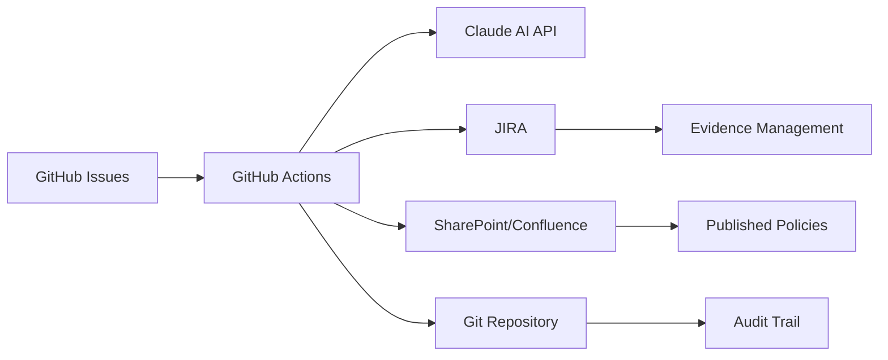
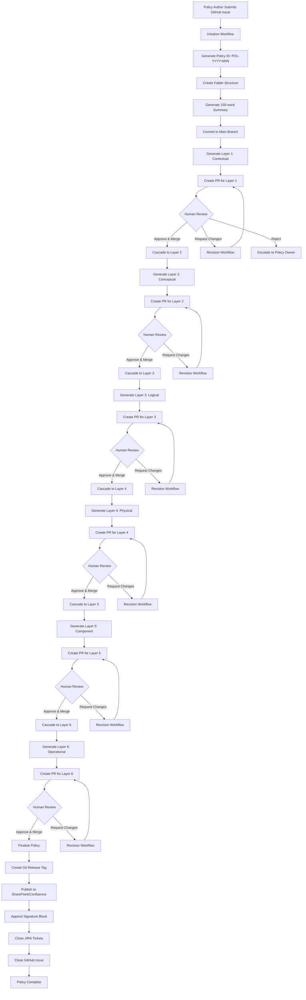
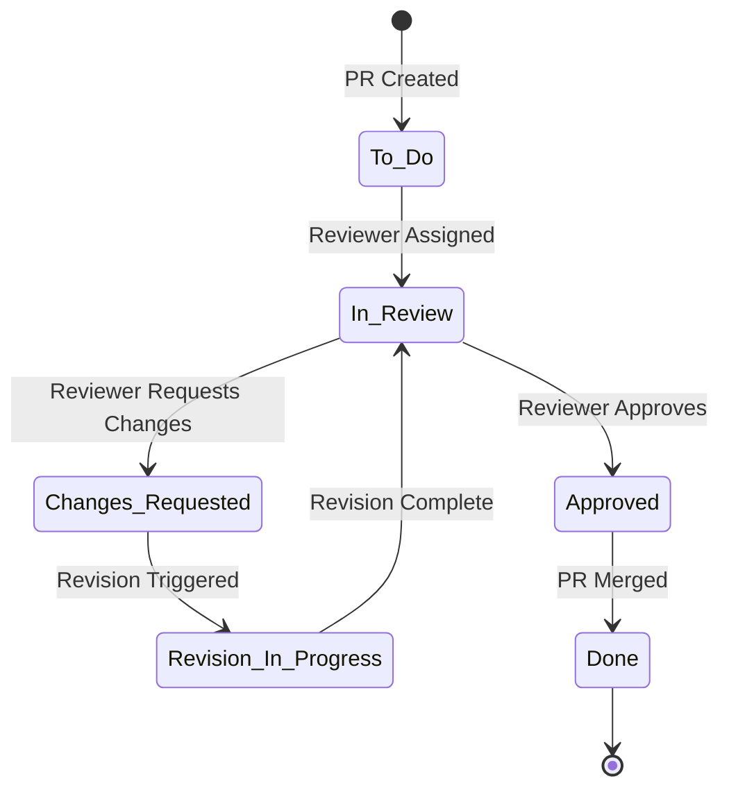
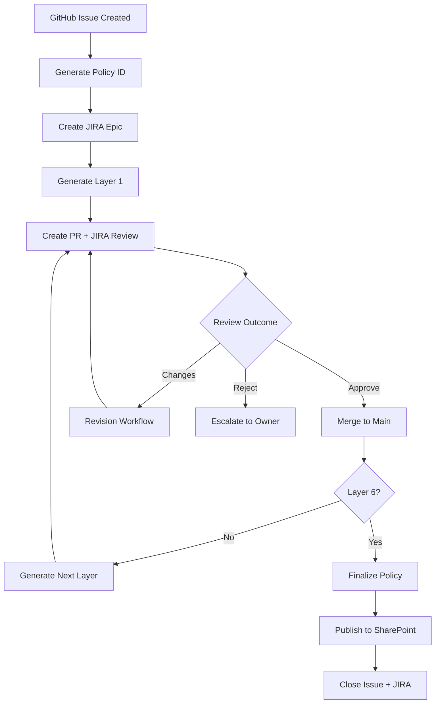
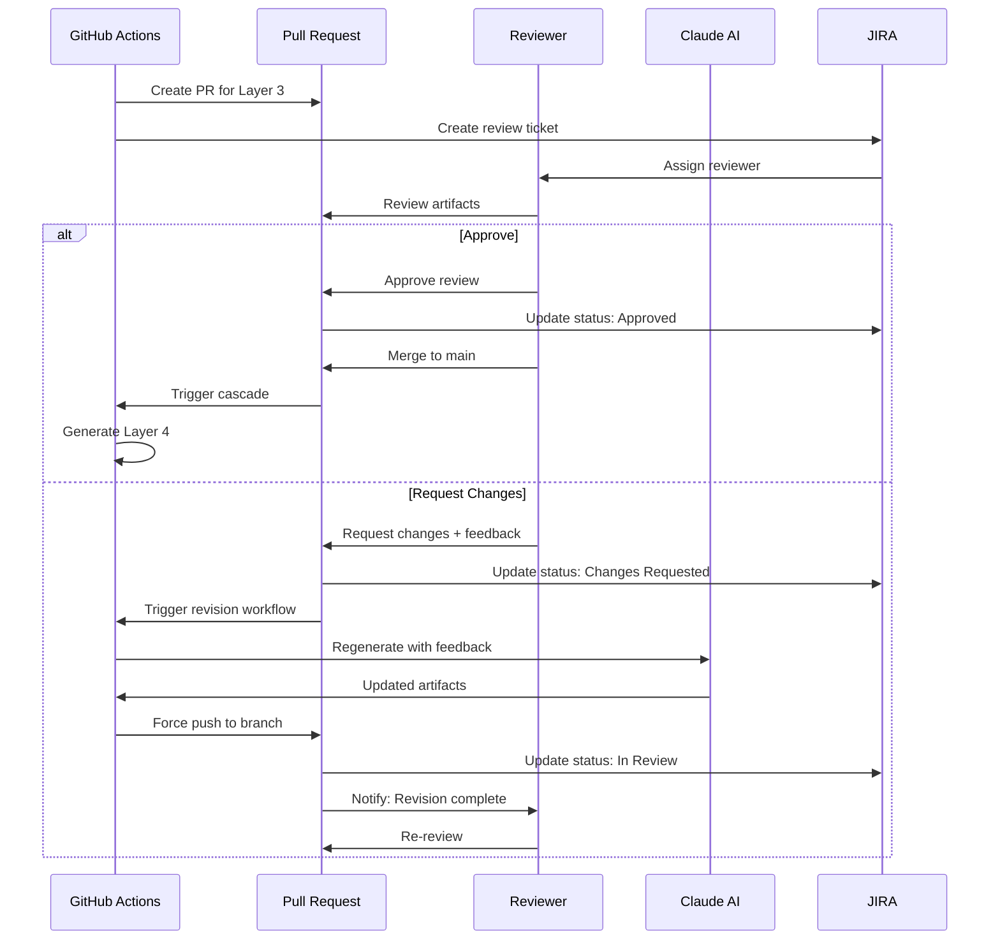
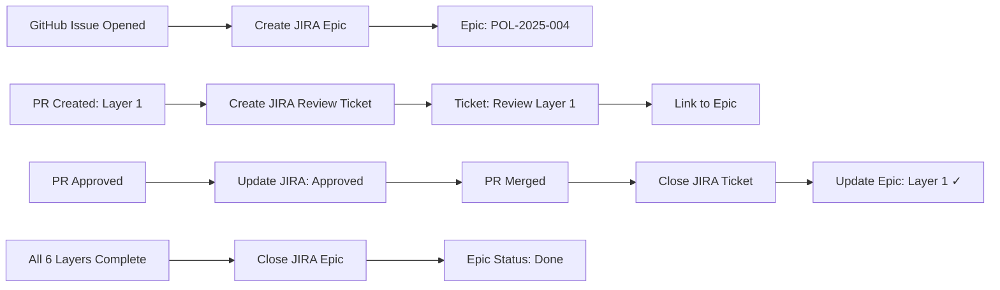
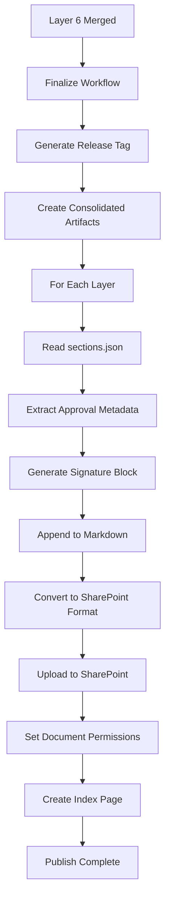
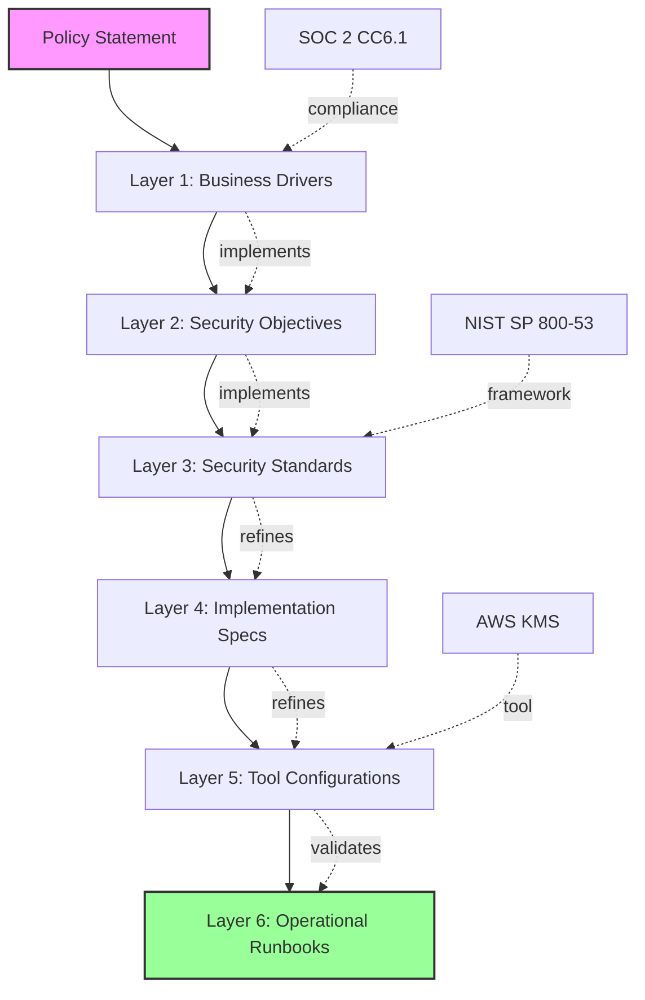

# SABSA Agentic Policy Workflow - Complete Walkthrough

**Version:** 1.0
**Date:** January 6, 2026
**Status:** Production Documentation

---

## Table of Contents

1. [Executive Summary](#1-executive-summary)
2. [Process Flow Overview](#2-process-flow-overview)
3. [Detailed Workflow Stages](#3-detailed-workflow-stages)
4. [Git Workflow Details](#4-git-workflow-details)
5. [JIRA Integration Details](#5-jira-integration-details)
6. [Audit Traceability Matrix](#6-audit-traceability-matrix)
7. [Document Storage Strategy](#7-document-storage-strategy)
8. [Compliance and Audit Considerations](#8-compliance-and-audit-considerations)
9. [Process Flow Diagrams](#9-process-flow-diagrams)
10. [Role-Based Workflow Views](#10-role-based-workflow-views)
11. [Integration Configuration Examples](#11-integration-configuration-examples)
12. [Troubleshooting Guide](#12-troubleshooting-guide)
13. [Future Enhancements](#13-future-enhancements)

---

## 1. Executive Summary

### 1.1 Overview of the Complete Workflow

The SABSA Agentic Policy Workflow system transforms security policy statements into comprehensive, traceable SABSA (Sherwood Applied Business Security Architecture) artifacts across all six architectural layers using AI-powered automation with human oversight gates.

**Key Characteristics:**
- **Platform:** GitHub Actions with native Pull Request review mechanics
- **AI Engine:** Anthropic Claude (claude-sonnet-4-20250514)
- **Pattern:** GitOps — policy artifacts managed as code with complete version history
- **Review Model:** One PR per SABSA layer with cascading approval triggers
- **Integration:** JIRA for task management, SharePoint/Confluence for publication
- **Audit Trail:** Complete immutable audit trail via Git history

### 1.2 Key Stakeholders and Their Roles

| Stakeholder | Role | Primary Responsibilities |
|-------------|------|-------------------------|
| **Policy Authors** | Submitters | Submit policy statements via GitHub Issue, provide business context |
| **Security Architects** | Reviewers (Layers 1-3) | Review Contextual, Conceptual, and Logical layers for business alignment |
| **Technical Architects** | Reviewers (Layers 4-5) | Review Physical and Component layers for implementation accuracy |
| **Operations Teams** | Reviewers (Layer 6) | Review Operational layer for maintainability and runbook completeness |
| **Compliance Officers** | Validators | Verify framework alignment (NIST, ISO, SOC2, GDPR) across all layers |
| **Auditors** | External Reviewers | Query Git history for complete audit trail and compliance evidence |
| **GitHub Actions** | Automation Engine | Execute workflows, call Claude API, manage PRs and branches |

### 1.3 Integration Points



**Integration Summary:**
- **GitHub:** Primary platform for workflow orchestration, PR reviews, version control
- **JIRA:** Task tracking, evidence collection, manual review workflows
- **SharePoint/Confluence:** Published document repository with signed versions
- **Claude AI:** Artifact generation with framework alignment (NIST, ISO, CIS)
- **Git:** Immutable audit trail with complete version history

### 1.4 Audit Traceability Objectives

The system provides complete traceability from policy initiation through publication:

1. **Policy Lineage:** Track policy statement → business requirement → technical control → implementation → operational runbook
2. **Change Attribution:** Every modification linked to author, approver, timestamp, and rationale
3. **Compliance Mapping:** Explicit references to NIST, ISO 27001, SOC2, GDPR, PCI DSS frameworks
4. **Review History:** Complete record of all review cycles, feedback, and revisions
5. **Publication Audit:** Signed documents with approval metadata, version history, and change summaries

---

## 2. Process Flow Overview

### 2.1 High-Level Process Flow



### 2.2 The Six SABSA Layers

| Layer | Number | View | Core Question | Primary Artifacts | Reviewer Profile |
|-------|--------|------|---------------|-------------------|------------------|
| **Contextual** | 1 | Business | What does the business need? | Business drivers, risks, success criteria | Senior management, business analysts |
| **Conceptual** | 2 | Architect | What security capabilities? | Security objectives, services, principles, trust model | Security architects, CISOs |
| **Logical** | 3 | Designer | What are the security rules? | Policies, standards, control specifications | Policy managers, compliance officers |
| **Physical** | 4 | Builder | How will it be implemented? | Procedures, technical standards, integration specs | Technical architects, engineers |
| **Component** | 5 | Tradesman | What specific tools/configs? | Tool configs, IaC templates, validation tests | DevOps engineers, security engineers |
| **Operational** | 6 | Operations | How will it be maintained? | Runbooks, monitoring, incident response playbooks | Operations teams, SOC analysts |

### 2.3 Key Workflow Principles

1. **Artifacts as Code:** All policy documents stored in Git with full version control
2. **Human in the Loop:** Every layer requires explicit approval via GitHub PR before proceeding
3. **Minimal Context:** Each layer receives only necessary upstream sections (token optimization)
4. **Structured Traceability:** JSON captures all relationships; markdown for human-readable content
5. **Graceful Degradation:** Partial results surfaced for human intervention on AI generation failures
6. **Familiar UX:** Standard GitHub PR workflow — no custom interfaces to learn

---

## 3. Detailed Workflow Stages

### Stage 1: Policy Initiation

**Trigger:** GitHub Issue created with `new-policy` label
**Workflow:** `initialize-policy.yml`
**Duration:** ~2-3 minutes

#### Process Steps

1. **Issue Creation**
   - Policy author fills out GitHub Issue template
   - Required fields: Policy title, policy statement
   - Optional fields: Business context, priority, requested reviewer

2. **Policy ID Generation**
   - System queries existing policies for highest sequence number
   - Generates ID in format `POL-{YYYY}-{NNN}` (e.g., `POL-2025-004`)
   - Year-based sequential numbering with zero-padding

3. **Folder Structure Creation**
   ```
   policies/POL-2025-004/
   ├── metadata.json              # Policy status, timestamps, layer tracking
   ├── summary.md                 # AI-generated 150-word summary
   ├── input/
   │   └── policy-statement.md    # Original policy text from issue
   ├── contextual/                # Empty - awaiting Layer 1 generation
   ├── conceptual/                # Empty - awaiting Layer 2 generation
   ├── logical/                   # Empty - awaiting Layer 3 generation
   ├── physical/                  # Empty - awaiting Layer 4 generation
   ├── component/                 # Empty - awaiting Layer 5 generation
   └── operational/               # Empty - awaiting Layer 6 generation
   ```

4. **Summary Generation**
   - Claude API called with `prompts/summary-prompt.md`
   - Target: ≤150 words capturing policy intent
   - Output written to `summary.md`

5. **Commit to Main**
   - Single commit: `[POL-2025-004] Initialize policy: Customer PII Encryption Policy`
   - Includes: folder structure, metadata, summary, policy statement
   - Pushed directly to `main` branch (no PR for initialization)

6. **JIRA Integration (Future)**
   - Auto-create JIRA epic for policy tracking
   - Link GitHub Issue to JIRA epic
   - Set epic status to "In Progress"

#### Audit Trail Captured

| Event | Data Captured | Storage |
|-------|---------------|---------|
| Issue creation | Creator identity, timestamp, policy text | GitHub Issue (immutable) |
| Policy ID generation | ID, year, sequence number | `metadata.json` + Git commit |
| Summary generation | Claude model, timestamp, prompt, response | `summary.md` + Git commit |
| Folder creation | Complete directory structure | Git commit |

**Output:** Policy initialized in `main` branch, ready for Layer 1 generation

---

### Stage 2: Layer Generation (Repeat for Each Layer 1-6)

**Trigger:** `workflow_call` from initialize, cascade, or revision workflows
**Workflow:** `generate-layer.yml`
**Duration:** ~3-5 minutes per layer

#### Process Steps

1. **Load Configuration**
   - Read `config/layer-dependencies.json` for required upstream sections
   - Read `config/layer-sections.json` for expected output structure
   - Extract layer number, display name, expected sections

2. **Assemble Context**
   - **Always included:** `policies/{policy-id}/summary.md` (150-word policy summary)
   - **Upstream sections:** Based on dependency matrix (example for Layer 3 Logical):
     - Section 2-1: Security Objectives
     - Section 2-2: Security Services
     - Section 2-3: Security Principles
   - **Context size:** ~2,900 tokens (well within Claude's limits)

3. **Build Prompt**
   - Combine: System prompt + Policy summary + Upstream context + Layer-specific instructions
   - Example structure:
     ```
     [System Prompt: SABSA expert, framework alignment, JSON output]
     [Policy Summary: 150-word overview]
     [Upstream Section 2-1: Security Objectives]
     [Upstream Section 2-2: Security Services]
     [Upstream Section 2-3: Security Principles]
     [Layer 3 Logical Prompt: Generate policies, standards, control specs]
     [Expected Output Schema: JSON with sections 3-1, 3-2, 3-3, 3-4, 3-5]
     [Revision Feedback: If applicable]
     ```

4. **Call Claude Action**
   - Invoke `.github/actions/call-claude` (JavaScript composite action)
   - Model: `claude-sonnet-4-20250514`
   - Max tokens: 8000
   - Retry logic: Up to 3 attempts with exponential backoff (1s → 2s → 4s)
   - Handles: Rate limits, timeouts, server errors

5. **Process Response**
   - Parse JSON output into `sections.json`
   - Validate all expected sections present
   - Extract traceability references into `traceability.json`
   - **Graceful degradation:** Capture partial results if validation fails

6. **Write Artifacts**
   - **sections.json:** Content + rationale + metadata
     ```json
     {
       "policyId": "POL-2025-004",
       "layer": "logical",
       "version": 1,
       "generatedAt": "2026-01-06T10:00:00Z",
       "generationStatus": "complete",
       "generatedBy": {
         "workflow": "generate-layer.yml",
         "job": "generate",
         "runId": "12345",
         "runNumber": "7"
       },
       "sections": {
         "3-1": {
           "title": "Security Policies",
           "content": "## 3.1 Security Policies\n\n...",
           "rationale_why": "NIST SP 800-53 SC-28...",
           "rationale_condition": "Satisfies Security Objective 2-1..."
         }
       },
       "errors": []
     }
     ```
   - **traceability.json:** Upstream references with relationship types
     ```json
     {
       "policyId": "POL-2025-004",
       "layer": "logical",
       "version": 1,
       "generatedAt": "2026-01-06T10:00:00Z",
       "references": {
         "3-1": [
           {
             "source": "POL-2025-004.conceptual.2-1",
             "relationship": "implements",
             "description": "Implements confidentiality objective for customer PII"
           }
         ]
       }
     }
     ```

7. **Update Metadata**
   - Set layer status to `pending-review`
   - Record generation timestamp
   - Update `metadata.json` in policy folder

8. **Create Feature Branch**
   - Branch name: `policy/POL-2025-004/layer-3-logical`
   - For revisions: Reuse existing branch (force push)
   - For new generation: Create new branch

9. **Commit Artifacts**
   - Commit message: `[POL-2025-004] Generate Layer 3: Logical`
   - For revisions: `[POL-2025-004] Layer 3 Logical: Revision based on feedback`
   - Push to feature branch

#### Audit Trail Captured

| Event | Data Captured | Storage |
|-------|---------------|---------|
| Context assembly | Upstream sections used, summary included | Workflow logs |
| Prompt construction | Complete prompt text | Workflow logs (can be exported) |
| Claude API call | Model, timestamp, request/response | Workflow logs, `sections.json` metadata |
| Artifact generation | All sections, rationale, traceability | `sections.json`, `traceability.json` |
| Validation results | Complete/partial status, errors | `sections.json` errors array |
| Branch creation | Branch name, commit SHA | Git history |

**Output:** Feature branch with layer artifacts, ready for PR creation

---

### Stage 3: Pull Request Creation

**Trigger:** End of `generate-layer.yml` workflow
**Actor:** GitHub Actions bot
**Duration:** <1 minute

#### Process Steps

1. **Check for Existing PR**
   - Query GitHub API for open PRs from branch `policy/POL-2025-004/layer-3-logical`
   - If exists (revision scenario): Update PR body
   - If not exists: Create new PR

2. **Build PR Description**
   - **Title:** `[POL-2025-004] Layer 3: Logical`
   - **Body:** Generated from structured template including:
     - Policy ID and layer information
     - Generation status (complete/partial)
     - Review checklist
     - Section summary table
     - Warning banner if partial generation
     - Review action guidance

   Example PR description:
   ```markdown
   ## SABSA Artifact: Logical Layer

   **Policy ID:** `POL-2025-004`
   **Layer:** 3 of 6 — Logical
   **Status:** complete

   ---

   ### Review Checklist

   - [ ] All sections are complete and coherent
   - [ ] Rationale references appropriate frameworks
   - [ ] Traceability links to correct upstream elements
   - [ ] Content aligns with organizational context
   - [ ] Technical accuracy verified

   ---

   ### Review Actions

   | Action | Result |
   |--------|--------|
   | **Approve & Merge** | Triggers generation of next layer |
   | **Request Changes** | Triggers automated revision with your feedback |
   | **Close PR** | Halts policy workflow (requires manual restart) |
   ```

3. **Add Labels**
   - `sabsa-artifact` — Applied to all layer PRs
   - `layer-3` — Layer identification
   - `needs-manual-review` — If partial generation occurred

4. **Assign Reviewer**
   - Read `metadata.json` for `requestedReviewer`
   - If specified: Auto-assign via GitHub API
   - If not specified: Leave unassigned for manual assignment

5. **JIRA Integration (Future)**
   - Auto-create JIRA ticket: `[POL-2025-004] Review Layer 3 (Logical)`
   - Link PR URL to JIRA ticket
   - Set JIRA status to "In Review"
   - Populate JIRA description with review checklist

#### Audit Trail Captured

| Event | Data Captured | Storage |
|-------|---------------|---------|
| PR creation | PR number, title, branch, target, creator | GitHub PR (immutable) |
| PR body generation | Complete description, checklist | GitHub PR |
| Label assignment | All applied labels with timestamps | GitHub PR |
| Reviewer assignment | Assigned reviewer(s), timestamp | GitHub PR |
| JIRA ticket creation | Ticket ID, link to PR | JIRA + GitHub PR comment |

**Output:** GitHub PR ready for human review, JIRA ticket created

---

### Stage 4: Human Review Process

**Location:** GitHub Pull Request interface
**Reviewers:** Assigned based on layer (see section 2.2)
**Duration:** 1-3 days (business process dependent)

#### 4a. Initial Review

**Reviewer Actions:**

1. **Open PR in GitHub**
   - Navigate to pull request
   - Review PR description and checklist

2. **Review Files Changed Tab**
   - **sections.json:** View all generated sections, rationale, metadata
   - **traceability.json:** Verify upstream references are correct
   - **metadata.json:** Check layer status updates

3. **Validate Against Document Guide**
   - Check against `config/document-guides/{layer}-guide.json`
   - Verify all required sections present
   - Confirm framework citations (NIST, ISO, CIS, etc.)
   - Assess technical accuracy and depth

4. **Review Traceability**
   - Verify each section traces to correct upstream elements
   - Check relationship types: `implements`, `derives_from`, `constrained_by`, `refines`, `validates`
   - Confirm no orphaned sections (all should trace upstream)

5. **Inline Comments (Optional)**
   - Comment on specific lines of `sections.json` for targeted feedback
   - Use GitHub's comment threading feature

#### 4b. Review Outcomes

**Option A: Approve**

- **Action:** Click "Approve" button in GitHub PR review
- **Result:**
  - PR marked as approved
  - JIRA ticket updated to "Approved"
  - Awaiting merge (manual or auto-merge)

**Audit Trail:**
- Approval timestamp: ISO 8601 UTC
- Approver identity: GitHub username, email
- Approval comments: Full text preserved

**Option B: Request Changes**

- **Action:** Click "Request changes" button + add feedback comments
- **Result:**
  - PR status changes to "Changes requested"
  - JIRA ticket updated to "Changes Requested"
  - Revision workflow triggered automatically
  - Feedback extracted and sent to Claude for regeneration

**Audit Trail:**
- Change request timestamp
- Reviewer identity
- Complete feedback text
- Revision iteration number

**Option C: Reject (Rare)**

- **Action:** Close PR without merge + provide rejection rationale
- **Result:**
  - PR closed
  - JIRA ticket updated to "Rejected"
  - Issue escalated to policy owner
  - Workflow halted (requires manual restart)

**Audit Trail:**
- Rejection timestamp
- Reviewer identity
- Rejection rationale
- Escalation path

#### Review Checklist Details

Reviewers verify the following for each layer:

| Check | Description | Failure Action |
|-------|-------------|----------------|
| **Completeness** | All expected sections present (e.g., 3-1, 3-2, 3-3, 3-4, 3-5 for Logical) | Request regeneration |
| **Coherence** | Content flows logically, no contradictions | Request changes with specific guidance |
| **Framework Alignment** | Proper citations to NIST, ISO 27001, CIS, SOC2, GDPR, etc. | Request additional framework references |
| **Traceability** | Each section links to upstream elements with correct relationship types | Request traceability fixes |
| **Organizational Context** | Content reflects actual business environment, not generic guidance | Request contextualization |
| **Technical Accuracy** | Technical details are correct and implementable | Request technical corrections |
| **Rationale Quality** | "Why suggested" and "condition satisfied" are clear and complete | Request rationale enhancement |

#### Audit Trail Captured

| Event | Data Captured | Storage |
|-------|---------------|---------|
| Review initiation | Reviewer identity, start timestamp | GitHub PR events |
| Inline comments | Comment text, line number, file, timestamp | GitHub PR comments |
| General comments | Comment text, timestamp | GitHub PR comments |
| Review decision | Approve/Changes/Reject, timestamp, comments | GitHub PR review |
| JIRA updates | Status change, timestamp, link to PR review | JIRA activity log |

**Output:** Approved PR (proceed to merge), Changes requested (proceed to revision), or Rejected (escalate)

---

### Stage 5: Revision Process (if changes requested)

**Trigger:** `pull_request_review` event with `changes_requested` action
**Workflow:** `handle-revision.yml`
**Duration:** ~3-5 minutes
**Max Iterations:** 3 (then manual intervention required)

#### Process Steps

1. **Extract Review Feedback**
   - Fetch all comments from PR review via GitHub API
   - Parse inline comments with file/line context
   - Extract general review comments
   - Structure as revision context JSON

2. **Build Revision Context**
   ```json
   {
     "generalFeedback": [
       "Section 3-3 should include explicit key rotation requirements",
       "Add PCI DSS reference for cardholder data encryption"
     ],
     "sectionFeedback": {
       "3-1": ["Include more detail on acceptable encryption algorithms"],
       "3-2": ["Specify minimum TLS version (1.2 or 1.3)"]
     },
     "revisionNumber": 1
   }
   ```

3. **Trigger Regeneration**
   - Call `generate-layer.yml` with same `policy-id` and `layer`
   - Pass `revision-context` with structured feedback
   - Claude receives feedback in prompt:
     ```
     ## Revision Feedback

     The following feedback was provided on the previous version.
     Please address these comments:

     **General Feedback:**
     - Section 3-3 should include explicit key rotation requirements
     - Add PCI DSS reference for cardholder data encryption

     **Section-Specific Feedback:**
     - Section 3-1: Include more detail on acceptable encryption algorithms
     - Section 3-2: Specify minimum TLS version (1.2 or 1.3)
     ```

4. **Update Branch**
   - Force-push updated artifacts to existing PR branch
   - PR automatically updated with new commit
   - Diff shows changes from previous version

5. **Update Metadata**
   - Increment revision counter in `metadata.json`
   - Record feedback incorporated
   - Track revision timestamp

6. **Notify Reviewer**
   - GitHub automatic notification via PR update
   - Add comment to PR: "✅ **Revision Complete** - The layer has been regenerated based on your feedback. Please review the updated artifacts."
   - JIRA ticket updated to "Revision In Progress" → "In Review"

7. **Check Revision Limit**
   - If revision count ≥ 3:
     - Add label `revision-limit-reached`
     - Comment on PR with manual intervention guidance
     - Halt automated revisions

#### Audit Trail Captured

| Event | Data Captured | Storage |
|-------|---------------|---------|
| Feedback extraction | All comments, reviewers, timestamps | `metadata.json` + workflow logs |
| Revision context | Structured feedback JSON | Passed to Claude, logged in workflow |
| Regeneration | Claude response, new sections, traceability | `sections.json` v2, Git commit |
| Force push | New commit SHA, diff from previous version | Git history |
| Revision notification | Comment text, timestamp | GitHub PR comment |
| Revision count | Iteration number, limit check | `metadata.json` |

**Output:** Updated PR with revised artifacts, awaiting re-review

---

### Stage 6: Merge and Cascade

**Trigger:** PR approved and merged to `main` branch
**Workflow:** `cascade-next-layer.yml`
**Duration:** <1 minute

#### Process Steps

1. **Detect Merged PR**
   - Triggered on `pull_request` event with `closed` action where `merged == true`
   - Branch must match pattern `policy/*/layer-*`
   - Verify merge target was `main` (not another branch)

2. **Parse Branch Name**
   - Extract policy ID: `POL-2025-004`
   - Extract layer number: `3`
   - Extract layer name: `logical`

3. **Determine Next Layer**
   - Layer progression:
     - contextual → conceptual
     - conceptual → logical
     - logical → physical
     - physical → component
     - component → operational
     - operational → **finalization**
   - Set `is_final` flag if operational layer

4. **Update Metadata**
   - Set completed layer status to `approved`
   - Record PR number and merge timestamp
   - Update `metadata.json` in `main` branch

5. **Commit Metadata Update**
   - Commit message: `[POL-2025-004] Mark logical layer as approved (PR #14)`
   - Push to `main` branch

6. **Trigger Next Action**
   - If NOT final layer: Trigger `generate-layer.yml` with next layer
   - If final layer: Trigger `finalize-policy.yml`

7. **JIRA Integration (Future)**
   - Close JIRA review ticket for current layer
   - Mark as "Done" with link to merged PR
   - If NOT final: Create JIRA ticket for next layer review

#### Audit Trail Captured

| Event | Data Captured | Storage |
|-------|---------------|---------|
| Merge detection | PR number, merge commit SHA, merger identity, timestamp | Git history + workflow logs |
| Branch parsing | Policy ID, layer number, layer name | Workflow logs |
| Next layer determination | Next layer name, is_final flag | Workflow logs |
| Metadata update | Layer status, PR number, merge timestamp | `metadata.json` + Git commit |
| Cascade trigger | Workflow triggered, inputs passed | GitHub Actions logs |
| JIRA close | Ticket status, resolution, timestamp | JIRA activity log |

**Output:** Next layer generation triggered (or finalization if Layer 6)

---

### Stage 7: Publication to SharePoint/Confluence

> **Note:** This stage is future functionality. The core Git-based workflow is operational; SharePoint/Confluence integration is planned for Phase 4.

**Trigger:** Policy finalization after Layer 6 (Operational) merge
**Workflow:** `publish-to-sharepoint.yml` (future)
**Duration:** ~2-3 minutes

#### 7a. Markdown to Published Format Conversion

1. **Detect Finalization**
   - `finalize-policy.yml` completes
   - All 6 layers approved and merged
   - Policy status: `completed`

2. **Extract Metadata**
   - Read `metadata.json` for policy ID, title, all layer statuses
   - Extract approval details from each layer:
     - Approved by (GitHub username, email)
     - Approval date (ISO 8601 UTC)
     - PR number
     - Git commit SHA

3. **Convert Markdown Sections**
   - For each layer, read `sections.json`
   - Extract all section content (markdown format)
   - Convert to SharePoint/Confluence-compatible HTML/markdown
   - Preserve formatting: headings, lists, tables, code blocks

#### 7b. Document Signing and Versioning

1. **Generate Signature Block**
   - Append to each layer document:
     ```markdown
     ---
     ## Document Metadata

     **Document Version:** 1.0
     **Policy ID:** POL-2025-004
     **Layer:** Logical (Layer 3)

     ### Approval Details

     - **Approved By:** John Smith (john.smith@example.com)
     - **Approval Date:** 2026-01-06 14:32:00 UTC
     - **GitHub PR:** #14
     - **JIRA Ticket:** SEC-1234
     - **Git Commit:** `a1b2c3d4e5f6g7h8i9j0`

     ### Change Summary

     - Initial version - Security policies established
     - Risk context aligned with GDPR Article 32 requirements
     - Success criteria defined with measurable KPIs
     - Traceability links verified to Conceptual layer

     ### Traceability

     - **Source Policy Statement:** `policies/POL-2025-004/input/policy-statement.md`
     - **Generation Date:** 2026-01-05 18:45:00 UTC
     - **Validation:** Passed (26/26 checks)
     - **Framework References:** NIST SP 800-53, ISO 27001, SOC2 CC6.1

     ---
     ```

2. **Version Information**
   - Version number: `1.0` (initial publication)
   - Increment for updates: `1.1`, `1.2`, `2.0`, etc.
   - Version history tracked in SharePoint/Confluence

3. **Generate Change Summary**
   - For initial version: "Initial publication"
   - For updates: Compare previous version, summarize changes
   - Include reason for update (e.g., "Revised to address audit finding")

#### 7c. SharePoint/Confluence Upload

1. **Authenticate to SharePoint/Confluence**
   - Use service account credentials from GitHub Secrets
   - OAuth 2.0 for SharePoint
   - API token for Confluence

2. **Create Document Structure**
   - Document path: `SABSA Policies/{policy-id}/`
   - For each layer:
     - Upload: `Layer-{n}-{layer-name}-v1.0.md`
     - Example: `Layer-3-Logical-v1.0.md`

3. **Upload Documents**
   - POST to SharePoint/Confluence API
   - Set metadata:
     - Title: `[POL-2025-004] Layer 3: Logical`
     - Version: `1.0`
     - Author: `GitHub Actions (automated)`
     - Approval status: `Approved`
     - Approval date, approver
   - Set permissions:
     - Read-only for general users
     - Edit for policy administrators

4. **Create/Update Index Page**
   - Index document: `SABSA Policies/{policy-id}/00-Index.md`
   - Contents:
     ```markdown
     # POL-2025-004: Customer PII Encryption Policy

     **Status:** Approved and Published
     **Version:** 1.0
     **Published:** 2026-01-06

     ## Policy Summary

     [150-word summary from summary.md]

     ## Layer Documents

     - [Layer 1: Contextual (v1.0)](./Layer-1-Contextual-v1.0.md)
     - [Layer 2: Conceptual (v1.0)](./Layer-2-Conceptual-v1.0.md)
     - [Layer 3: Logical (v1.0)](./Layer-3-Logical-v1.0.md)
     - [Layer 4: Physical (v1.0)](./Layer-4-Physical-v1.0.md)
     - [Layer 5: Component (v1.0)](./Layer-5-Component-v1.0.md)
     - [Layer 6: Operational (v1.0)](./Layer-6-Operational-v1.0.md)

     ## Approval History

     | Layer | Approved By | Date | PR |
     |-------|-------------|------|----|
     | Contextual | Alice Johnson | 2026-01-02 | #10 |
     | Conceptual | Bob Martinez | 2026-01-03 | #11 |
     | Logical | John Smith | 2026-01-06 | #14 |
     | Physical | Carol White | 2026-01-08 | #15 |
     | Component | David Lee | 2026-01-10 | #16 |
     | Operational | Eve Taylor | 2026-01-12 | #17 |

     ## Traceability Matrix

     [Link to complete traceability report]

     ## Compliance Validation Summary

     [Link to compliance validation results from Layer 5]
     ```

5. **Generate Complete Policy Package**
   - Consolidated document: `Complete-Policy-v1.0.md`
   - Contains all 6 layers in single document
   - Traceability matrix: `Traceability-Matrix-v1.0.md`
   - Compliance summary: `Compliance-Validation-Summary-v1.0.md`

#### Audit Trail Captured

| Event | Data Captured | Storage |
|-------|---------------|---------|
| Conversion trigger | Policy ID, finalization timestamp | Workflow logs |
| Metadata extraction | All approval details, PR numbers, commit SHAs | Signature blocks |
| Signature generation | Approver identity, dates, traceability | Signed documents |
| SharePoint upload | Document IDs, URLs, permissions | SharePoint metadata + workflow logs |
| Index creation | All layer links, approval history | SharePoint index page |
| Version tracking | Version number, change summary | SharePoint/Confluence version history |

**Output:** Published policy documents in SharePoint/Confluence with signature blocks

---

### Stage 8: Finalization (After Layer 6)

**Trigger:** Cascade workflow detects operational (Layer 6) merge
**Workflow:** `finalize-policy.yml`
**Duration:** ~2-3 minutes

#### Process Steps

1. **Update Metadata to Complete**
   - Set policy status to `completed`
   - Record completion timestamp
   - Set all layer statuses to `approved`
   - Update `metadata.json` in `main` branch

2. **Create Git Release Tag**
   - Tag format: `policy/POL-2025-004/v1.0`
   - Release title: `POL-2025-004: Customer PII Encryption Policy - Complete`
   - Release description:
     ```markdown
     ## Policy Release v1.0

     **Policy ID:** POL-2025-004
     **Title:** Customer PII Encryption Policy
     **Completed:** 2026-01-12 15:30:00 UTC

     ### Layer Summary

     - **Layer 1 (Contextual):** Business drivers and risk context ([PR #10](link))
     - **Layer 2 (Conceptual):** Security objectives and trust model ([PR #11](link))
     - **Layer 3 (Logical):** Security policies and standards ([PR #14](link))
     - **Layer 4 (Physical):** Implementation specifications ([PR #15](link))
     - **Layer 5 (Component):** Tool configurations and validation ([PR #16](link))
     - **Layer 6 (Operational):** Runbooks and monitoring ([PR #17](link))

     ### Traceability

     Complete traceability from business requirement to operational runbook verified.

     ### Compliance

     - NIST SP 800-53: SC-28, SC-13, AC-7
     - ISO 27001: A.10.1.1, A.10.1.2
     - SOC 2: CC6.1, CC6.7
     - GDPR: Article 32
     ```

3. **Generate Consolidated Artifacts**
   - **Complete Policy Document:** All 6 layers in single markdown file
   - **Traceability Matrix:** Full lineage from Layer 1 to Layer 6
     ```markdown
     # Traceability Matrix: POL-2025-004

     ## Layer 6 → Layer 5 → Layer 4 → Layer 3 → Layer 2 → Layer 1

     | Operational (6) | Component (5) | Physical (4) | Logical (3) | Conceptual (2) | Contextual (1) |
     |-----------------|---------------|--------------|-------------|----------------|----------------|
     | 6-2 Key Rotation Runbook | 5-1 AWS KMS Config | 4-2 Key Rotation Proc | 3-2 Key Rotation Std | 2-1 Key Security Obj | 1-2 SOC2 Compliance Driver |
     ```
   - **Compliance Validation Summary:** Results from Layer 5 validation checks
   - **Implementation Checklist:** Consolidated deployment checklist from Layer 5

4. **Attach to Release**
   - Upload consolidated artifacts to GitHub Release
   - Artifacts available for download as `.zip` or individual files

5. **Close Source Issue**
   - Add comment with completion summary:
     ```markdown
     ## ✅ Policy Workflow Complete

     **Policy ID:** POL-2025-004
     **Completed:** 2026-01-12 15:30:00 UTC
     **Release:** [v1.0](link to release)

     All 6 SABSA layers have been generated, reviewed, and approved.

     **Next Steps:**
     - Review published documents in SharePoint: [Link]
     - Review compliance validation results: [Link]
     - Proceed with implementation using Component layer artifacts
     ```
   - Close issue with label `completed`

6. **Close JIRA Tickets (Future)**
   - Close all JIRA review tickets for all 6 layers
   - Close JIRA epic with resolution "Complete"
   - Add link to GitHub release in epic comments

7. **Trigger Publication (Future)**
   - If SharePoint/Confluence integration enabled, trigger `publish-to-sharepoint.yml`

#### Audit Trail Captured

| Event | Data Captured | Storage |
|-------|---------------|---------|
| Finalization trigger | Policy ID, timestamp, trigger source | Workflow logs |
| Metadata update | Final status, completion timestamp | `metadata.json` + Git commit |
| Release creation | Tag, title, description, artifacts | GitHub Release (immutable) |
| Artifact generation | Complete policy, traceability matrix, compliance summary | Git + GitHub Release |
| Issue closure | Closure timestamp, final comment | GitHub Issue |
| JIRA closure | Epic status, resolution, timestamp | JIRA activity log |

**Output:** Policy marked complete, release tagged, issue closed, JIRA tickets closed

---

## 4. Git Workflow Details

### 4.1 Branch Strategy

```
main (protected)
  ├── policy/POL-2025-004/layer-1-contextual (ephemeral)
  ├── policy/POL-2025-004/layer-2-conceptual (ephemeral)
  ├── policy/POL-2025-004/layer-3-logical (ephemeral)
  ├── policy/POL-2025-004/layer-4-physical (ephemeral)
  ├── policy/POL-2025-004/layer-5-component (ephemeral)
  └── policy/POL-2025-004/layer-6-operational (ephemeral)
```

**Branch Characteristics:**
- **Naming pattern:** `policy/{policy-id}/layer-{n}-{layer-name}`
- **Lifecycle:** Created for layer generation, deleted after PR merge
- **Protection:** None (ephemeral branches, not protected)
- **Reuse:** For revisions, existing branch is force-pushed (not recreated)

**Main Branch Protection Rules:**
- ✅ Require pull request reviews before merging
- ✅ Require status checks to pass (future: validation workflows)
- ✅ Restrict pushes to GitHub Actions bot only (for workflow commits)
- ❌ Do NOT restrict force pushes to branches (needed for revisions)

### 4.2 Commit Message Convention

All commits follow the pattern: `[{policy-id}] {action}: {description}`

**Examples:**

| Commit Type | Example | When Used |
|-------------|---------|-----------|
| Initialization | `[POL-2025-004] Initialize policy: Customer PII Encryption Policy` | `initialize-policy.yml` commits to `main` |
| Layer generation | `[POL-2025-004] Generate Layer 3: Logical` | `generate-layer.yml` commits to feature branch |
| Revision | `[POL-2025-004] Layer 3 Logical: Revision based on feedback` | `handle-revision.yml` force-pushes to feature branch |
| Metadata update | `[POL-2025-004] Mark logical layer as approved (PR #14)` | `cascade-next-layer.yml` commits to `main` |
| Finalization | `[POL-2025-004] Mark policy as completed` | `finalize-policy.yml` commits to `main` |

**Commit Metadata:**
- **Author:** `github-actions[bot] <github-actions[bot]@users.noreply.github.com>`
- **Co-Author:** `Claude AI <claude@anthropic.com>` (for AI-generated content)
- **Timestamp:** Always in UTC (ISO 8601)

**Example Full Commit:**
```
commit a1b2c3d4e5f6g7h8i9j0
Author: github-actions[bot] <github-actions[bot]@users.noreply.github.com>
Date:   Mon Jan 6 10:00:00 2026 +0000

    [POL-2025-004] Generate Layer 3: Logical

    - Generated sections.json with 5 sections
    - Generated traceability.json with 12 references
    - Validation: 26/26 checks passed

    Co-authored-by: Claude AI <claude@anthropic.com>
```

### 4.3 Merge Strategy

**Pull Request Merges:**
- **Method:** Squash and merge (recommended) or Merge commit
- **Reason:** Preserve all PR discussion and review history
- **Branch cleanup:** Automatic deletion of feature branch after merge

**Direct Commits to Main:**
- **Allowed for:** Workflow automation commits (metadata updates, initialization)
- **Not allowed for:** Human users (enforced by branch protection)

### 4.4 Git History Queries for Audit

**Query Examples:**

1. **Find all commits for a specific policy:**
   ```bash
   git log --all --grep="POL-2025-004"
   ```

2. **Show layer approval history:**
   ```bash
   git log --all --grep="Mark .* layer as approved" --oneline
   ```

3. **Extract traceability for a specific layer:**
   ```bash
   git show main:policies/POL-2025-004/logical/traceability.json
   ```

4. **Compare layer versions (before/after revision):**
   ```bash
   git diff commit1 commit2 -- policies/POL-2025-004/logical/sections.json
   ```

5. **Audit trail for entire policy lifecycle:**
   ```bash
   git log --all --grep="POL-2025-004" --format="%H|%an|%ae|%ad|%s" --date=iso
   ```

### 4.5 Git Tags for Releases

**Tag Pattern:** `policy/{policy-id}/v{major}.{minor}`

**Examples:**
- `policy/POL-2025-004/v1.0` — Initial release
- `policy/POL-2025-004/v1.1` — Minor update (typo fix, clarification)
- `policy/POL-2025-004/v2.0` — Major update (policy change)

**Tag Creation:**
```bash
git tag -a policy/POL-2025-004/v1.0 -m "Initial release of Customer PII Encryption Policy"
git push origin policy/POL-2025-004/v1.0
```

**List all policy releases:**
```bash
git tag -l "policy/POL-2025-004/*"
```

---

## 5. JIRA Integration Details

> **Note:** JIRA integration is future functionality (Phase 4). The workflows reference JIRA endpoints, but integration is not yet implemented.

### 5.1 Webhook Configuration

**GitHub → JIRA Integration:**

```yaml
# .github/workflows/jira-integration.yml (future)
name: JIRA Integration

on:
  issues:
    types: [opened]
  pull_request:
    types: [opened, closed]
  pull_request_review:
    types: [submitted]

jobs:
  sync-jira:
    runs-on: ubuntu-latest
    steps:
      - name: Create JIRA Epic
        if: github.event_name == 'issues' && contains(github.event.issue.labels.*.name, 'new-policy')
        uses: atlassian/gajira-create@v3
        with:
          project: SEC
          issuetype: Epic
          summary: "[POL-YYYY-NNN] Policy Title"
          description: "GitHub Issue: ${{ github.event.issue.html_url }}"

      - name: Create JIRA Review Ticket
        if: github.event_name == 'pull_request' && github.event.action == 'opened'
        uses: atlassian/gajira-create@v3
        with:
          project: SEC
          issuetype: Policy Review
          summary: "[{{ policy-id }}] Review Layer {{ layer-number }}"
          description: "GitHub PR: ${{ github.event.pull_request.html_url }}"

      - name: Update JIRA Status
        if: github.event_name == 'pull_request_review'
        uses: atlassian/gajira-transition@v3
        with:
          issue: ${{ steps.find-ticket.outputs.issue-key }}
          transition: ${{ github.event.review.state == 'approved' && 'Approved' || 'Changes Requested' }}
```

### 5.2 JIRA Ticket Structure

**Epic (Policy Tracking):**

```
Project: SEC (Security Policies)
Issue Type: Epic
Epic Name: POL-2025-004
Summary: Customer PII Encryption Policy

Description:
  GitHub Issue: #42
  Policy Statement: [Link to policy-statement.md]

  This epic tracks the complete SABSA workflow for POL-2025-004.

  Workflow Progress:
  - [x] Layer 1 (Contextual) - PR #10 - Approved
  - [x] Layer 2 (Conceptual) - PR #11 - Approved
  - [ ] Layer 3 (Logical) - PR #14 - In Review
  - [ ] Layer 4 (Physical) - Not Started
  - [ ] Layer 5 (Component) - Not Started
  - [ ] Layer 6 (Operational) - Not Started

Labels: sabsa-policy, pol-2025-004, encryption
Priority: High
Status: In Progress
```

**Review Ticket (Per Layer):**

```
Project: SEC
Issue Type: Policy Review
Summary: [POL-2025-004] Review Layer 3 (Logical)

Description:
  Policy: Customer PII Encryption Policy
  Layer: Layer 3 - Logical
  GitHub PR: #14
  Review Deadline: 2026-01-08

  Review Checklist:
  - [ ] All 5 sections present and complete (3-1, 3-2, 3-3, 3-4, 3-5)
  - [ ] Framework citations included (NIST, ISO, SOC2)
  - [ ] Rationale provided for each section
  - [ ] Traceability to Conceptual layer (2-1, 2-2, 2-3) verified
  - [ ] Technical accuracy confirmed

  Sections to Review:
  - 3-1: Security Policies
  - 3-2: Security Standards
  - 3-3: Logical Control Specifications
  - 3-4: Information Classification
  - 3-5: Logical Access Model

Labels: sabsa-policy, layer-3, pol-2025-004, review
Priority: High
Epic Link: POL-2025-004
```

### 5.3 JIRA Workflow States



**State Descriptions:**

| State | Trigger | Description |
|-------|---------|-------------|
| **To Do** | PR created | Review ticket created, awaiting reviewer assignment |
| **In Review** | Reviewer assigned | Reviewer is actively reviewing artifacts |
| **Changes Requested** | PR review: Request changes | Reviewer provided feedback, awaiting revision |
| **Revision In Progress** | Revision workflow triggered | Claude is regenerating artifacts based on feedback |
| **Approved** | PR review: Approved | Reviewer approved, awaiting merge |
| **Done** | PR merged | Layer artifacts merged to main, ticket closed |

### 5.4 JIRA Fields and Custom Properties

**Custom Fields (Future Implementation):**

| Field Name | Type | Purpose |
|------------|------|---------|
| `Policy ID` | Text | POL-YYYY-NNN identifier |
| `SABSA Layer` | Single Select | Dropdown: Contextual, Conceptual, Logical, Physical, Component, Operational |
| `Layer Number` | Number | 1-6 |
| `GitHub PR` | URL | Link to GitHub pull request |
| `Git Commit SHA` | Text | Commit hash for merged artifacts |
| `Approval Date` | Date | When PR was approved |
| `Approver` | User | GitHub username of approver |
| `Revision Count` | Number | Number of revision cycles |

### 5.5 JIRA Automation Rules (Future)

**Rule 1: Auto-transition on PR approval**
```
Trigger: Webhook from GitHub (PR approved)
Condition: Issue type = "Policy Review"
Action: Transition to "Approved"
```

**Rule 2: Auto-transition on PR merge**
```
Trigger: Webhook from GitHub (PR merged)
Condition: Issue type = "Policy Review"
Action:
  - Transition to "Done"
  - Add comment: "PR merged: [link]"
  - Set resolution: "Approved & Merged"
```

**Rule 3: Create next layer review ticket**
```
Trigger: Issue transitioned to "Done"
Condition: Layer number < 6
Action: Create new "Policy Review" ticket for next layer
```

---

## 6. Audit Traceability Matrix

### 6.1 Complete Audit Touchpoints

| Event | Timestamp | Actor | Artifact | Storage | Retention | Query Method |
|-------|-----------|-------|----------|---------|-----------|--------------|
| **Policy Initiation** | ISO 8601 UTC | GitHub user | GitHub Issue #42 | GitHub Issues | Permanent | GitHub API, Web UI |
| **Policy ID Generation** | ISO 8601 UTC | GitHub Actions | `POL-2025-004` | `metadata.json` + Git | Permanent | `git log`, `cat metadata.json` |
| **Summary Generation** | ISO 8601 UTC | Claude AI | `summary.md` | Git commit | Permanent | `git show main:policies/POL-2025-004/summary.md` |
| **Layer 1 Generation** | ISO 8601 UTC | Claude AI | `contextual/sections.json` | Git commit | Permanent | `git show commit:path` |
| **Layer 1 Traceability** | ISO 8601 UTC | Claude AI | `contextual/traceability.json` | Git commit | Permanent | `git show commit:path` |
| **PR 1 Creation** | ISO 8601 UTC | GitHub Actions | Pull Request #10 | GitHub PRs | Permanent | GitHub API, Web UI |
| **PR 1 Review Start** | ISO 8601 UTC | Alice Johnson | PR review event | GitHub PR events | Permanent | GitHub API |
| **PR 1 Inline Comments** | ISO 8601 UTC | Alice Johnson | PR comments | GitHub PR comments | Permanent | GitHub API, Web UI |
| **PR 1 Approval** | ISO 8601 UTC | Alice Johnson | PR review (approved) | GitHub PR reviews | Permanent | GitHub API, Web UI |
| **PR 1 Merge** | ISO 8601 UTC | Alice Johnson | Merge commit SHA | Git history | Permanent | `git log main` |
| **Metadata Update (L1)** | ISO 8601 UTC | GitHub Actions | `metadata.json` update | Git commit | Permanent | `git log -p metadata.json` |
| **Cascade to Layer 2** | ISO 8601 UTC | GitHub Actions | Workflow trigger | GitHub Actions logs | 90 days (default) | GitHub API |
| **Layer 2 Generation** | ISO 8601 UTC | Claude AI | `conceptual/sections.json` | Git commit | Permanent | `git show commit:path` |
| **... (Repeat for Layers 2-6)** | ... | ... | ... | ... | ... | ... |
| **Finalization** | ISO 8601 UTC | GitHub Actions | `metadata.json` status=completed | Git commit | Permanent | `git log -p metadata.json` |
| **Release Tag** | ISO 8601 UTC | GitHub Actions | `policy/POL-2025-004/v1.0` | Git tags | Permanent | `git tag -l`, GitHub Releases |
| **Consolidated Artifacts** | ISO 8601 UTC | GitHub Actions | Complete policy, traceability matrix | GitHub Release assets | Permanent | GitHub Releases API |
| **Issue Closure** | ISO 8601 UTC | GitHub Actions | Issue #42 closed | GitHub Issues | Permanent | GitHub API, Web UI |
| **SharePoint Publication** | ISO 8601 UTC | GitHub Actions | Layer documents with signatures | SharePoint | Permanent | SharePoint API, Web UI |
| **JIRA Epic Closure** | ISO 8601 UTC | GitHub Actions | Epic POL-2025-004 closed | JIRA | Permanent | JIRA API, Web UI |

### 6.2 Traceability Chain Example

**Question:** "Why do we encrypt customer PII with AES-256?"

**Traceability Path:**

```
1. Policy Statement (Input)
   └─ "All customer PII must be encrypted at rest using AES-256..."
       ↓
2. Layer 1 (Contextual) - Section 1-2: Business Drivers
   └─ "SOC 2 Type II certification requires encryption per CC6.1"
   └─ "GDPR Article 32 mandates appropriate technical measures including encryption"
       ↓
3. Layer 2 (Conceptual) - Section 2-1: Security Objectives
   └─ "Objective: Ensure customer PII confidentiality through encryption"
   └─ Traces to: 1-2 (Business Drivers) via "implements" relationship
       ↓
4. Layer 3 (Logical) - Section 3-2: Security Standards
   └─ "Standard: Use AES-256-GCM for data at rest encryption"
   └─ Rationale: "NIST SP 800-175B recommends AES-256 for data at rest"
   └─ Traces to: 2-1 (Security Objectives) via "implements" relationship
       ↓
5. Layer 4 (Physical) - Section 4-1: Control Implementation Specs
   └─ "Use AWS KMS with AES-256-GCM for RDS and S3 encryption"
   └─ Traces to: 3-2 (Security Standards) via "refines" relationship
       ↓
6. Layer 5 (Component) - Section 5-1: Tool Configuration
   └─ "Terraform: aws_kms_key with key_spec = SYMMETRIC_DEFAULT (AES-256)"
   └─ Traces to: 4-1 (Implementation Specs) via "refines" relationship
       ↓
7. Layer 6 (Operational) - Section 6-2: Operational Runbook
   └─ "Procedure: Verify KMS encryption on all RDS instances quarterly"
   └─ Traces to: 5-1 (Tool Configuration) via "validates" relationship
```

**Audit Response:**
- **Root Cause:** SOC 2 CC6.1 and GDPR Article 32 compliance requirements (Business Driver 1-2)
- **Technical Justification:** NIST SP 800-175B recommendation (Security Standard 3-2)
- **Implementation:** AWS KMS with AES-256-GCM (Component 5-1)
- **Verification:** Quarterly KMS encryption checks (Operational 6-2)
- **Evidence:** Complete Git history from policy statement to runbook

### 6.3 Audit Queries

**Example Queries:**

1. **Who approved Layer 3 on 2026-01-06?**
   ```bash
   # Git approach
   git log --all --grep="POL-2025-004" --grep="Layer 3" --grep="approved" --oneline

   # GitHub API approach
   gh pr view 14 --json reviews --jq '.reviews[] | select(.state=="APPROVED") | {author: .author.login, date: .submittedAt}'
   ```

2. **What changed between v1.0 and v1.1?**
   ```bash
   git diff policy/POL-2025-004/v1.0 policy/POL-2025-004/v1.1
   ```

3. **When was this policy published to SharePoint?**
   ```bash
   # Workflow logs approach
   gh run list --workflow=publish-to-sharepoint.yml --json databaseId,conclusion,createdAt

   # Git commit approach
   git log --all --grep="Publish to SharePoint" --grep="POL-2025-004"
   ```

4. **What feedback was incorporated in revision 2?**
   ```bash
   # Read PR comments from revision cycle
   gh pr view 14 --json reviews,comments --jq '.reviews[] | select(.state=="CHANGES_REQUESTED") | .body'
   ```

5. **Show complete audit trail for POL-2025-004:**
   ```bash
   git log --all --grep="POL-2025-004" --format="%H|%an|%ae|%ad|%s" --date=iso | \
     awk -F'|' '{print $4 " | " $2 " | " $5}'
   ```

---

## 7. Document Storage Strategy

### 7.1 Git Repository (Source of Truth)

**Location:** `policies/{policy-id}/`

**Structure:**
```
policies/POL-2025-004/
├── metadata.json                     # Policy status, layer progress, timestamps
├── summary.md                        # AI-generated 150-word summary
├── input/
│   └── policy-statement.md           # Original policy text from GitHub Issue
├── contextual/
│   ├── sections.json                 # Layer 1 artifacts (machine-readable)
│   └── traceability.json             # Upstream references
├── conceptual/
│   ├── sections.json                 # Layer 2 artifacts
│   └── traceability.json
├── logical/
│   ├── sections.json                 # Layer 3 artifacts
│   └── traceability.json
├── physical/
│   ├── sections.json                 # Layer 4 artifacts
│   └── traceability.json
├── component/
│   ├── sections.json                 # Layer 5 artifacts (includes validationChecks array)
│   └── traceability.json
├── operational/
│   ├── sections.json                 # Layer 6 artifacts
│   └── traceability.json
└── release/
    ├── complete-policy-v1.0.md       # Consolidated all 6 layers
    ├── traceability-matrix-v1.0.md   # Full lineage report
    └── compliance-validation-summary-v1.0.md  # Layer 5 validation results
```

**Access Patterns:**

| Use Case | Method | Example |
|----------|--------|---------|
| **Read current version** | `cat` or `git show main:path` | `cat policies/POL-2025-004/summary.md` |
| **Read specific version** | `git show commit:path` | `git show a1b2c3d4:policies/POL-2025-004/logical/sections.json` |
| **Compare versions** | `git diff` | `git diff v1.0 v1.1 -- policies/POL-2025-004/` |
| **Query traceability** | `jq` on `traceability.json` | `jq '.references["3-1"]' policies/POL-2025-004/logical/traceability.json` |
| **Extract all sections** | `jq` on `sections.json` | `jq '.sections | keys' policies/POL-2025-004/logical/sections.json` |

### 7.2 SharePoint/Confluence (Published Version)

> **Note:** This is future functionality (Phase 4).

**Location:** `SABSA Security Policies/{policy-id}/`

**Structure:**
```
SABSA Security Policies/
└── POL-2025-004 - Customer PII Encryption Policy/
    ├── 00-Index.md                           # Navigation page with all layer links
    ├── 01-Contextual-v1.0-APPROVED.md        # Layer 1 with signature block
    ├── 02-Conceptual-v1.0-APPROVED.md        # Layer 2 with signature block
    ├── 03-Logical-v1.0-APPROVED.md           # Layer 3 with signature block
    ├── 04-Physical-v1.0-APPROVED.md          # Layer 4 with signature block
    ├── 05-Component-v1.0-APPROVED.md         # Layer 5 with signature block
    ├── 06-Operational-v1.0-APPROVED.md       # Layer 6 with signature block
    ├── Complete-Policy-v1.0-SIGNED.md        # All layers in single document
    ├── Traceability-Matrix-v1.0.md           # Full traceability report
    └── Compliance-Validation-Summary-v1.0.md # Validation results
```

**Document Metadata (SharePoint Properties):**

| Property | Example Value | Source |
|----------|---------------|--------|
| `Title` | `[POL-2025-004] Layer 3: Logical` | Generated from policy ID + layer |
| `Version` | `1.0` | Git release tag |
| `Author` | `GitHub Actions (automated)` | Workflow identity |
| `Approval Status` | `Approved` | From `metadata.json` |
| `Approved By` | `John Smith (john.smith@example.com)` | PR approver |
| `Approval Date` | `2026-01-06T14:32:00Z` | PR approval timestamp |
| `Git Commit SHA` | `a1b2c3d4e5f6g7h8i9j0` | Merge commit hash |
| `GitHub PR` | `#14` | PR number |
| `JIRA Ticket` | `SEC-1234` | JIRA review ticket |
| `Framework References` | `NIST SP 800-53, ISO 27001, SOC2 CC6.1` | Extracted from sections |

**Permissions:**

| Role | Permission | Justification |
|------|------------|---------------|
| **All Authenticated Users** | Read-only | General access to approved policies |
| **Policy Administrators** | Read/Write | Ability to manually update published versions |
| **Compliance Officers** | Read-only | Audit and compliance verification |
| **Auditors (External)** | Read-only (time-limited) | Audit engagement access |

### 7.3 GitHub Releases (Versioned Snapshots)

**Release Pattern:** `policy/{policy-id}/v{major}.{minor}`

**Contents:**
- **Tag:** `policy/POL-2025-004/v1.0`
- **Title:** `POL-2025-004: Customer PII Encryption Policy - Complete`
- **Description:** Markdown summary with layer PR links, traceability summary, compliance references
- **Assets (Attachments):**
  - `complete-policy-v1.0.md` — All 6 layers consolidated
  - `traceability-matrix-v1.0.md` — Full lineage report
  - `compliance-validation-summary-v1.0.md` — Validation results
  - `policy-artifacts-v1.0.zip` — All JSON files (sections, traceability, metadata)

**Version History:**

| Version | Date | Changes | Trigger |
|---------|------|---------|---------|
| `v1.0` | 2026-01-12 | Initial release - All 6 layers approved | Layer 6 (Operational) merged |
| `v1.1` | 2026-02-15 | Typo fix in Layer 3, Section 3-2 | Manual update, re-review, re-merge |
| `v2.0` | 2026-06-01 | Policy change: Update key rotation from 90 days to 60 days | Policy revision initiated via new GitHub Issue |

---

## 8. Compliance and Audit Considerations

### 8.1 SOC 2 / ISO 27001 Compliance

**Requirement:** Document change control with approval workflows

**How the System Complies:**

| SOC 2 Control | System Implementation | Evidence Location |
|---------------|----------------------|-------------------|
| **CC6.1: Logical access controls** | All changes require PR approval; branch protection on `main` | GitHub branch protection settings, PR approval logs |
| **CC7.2: System monitoring** | Workflow execution logs, success/failure tracking | GitHub Actions logs (90-day retention) |
| **CC7.3: System availability** | GitHub's 99.95% uptime SLA | GitHub status page, incident reports |
| **CC8.1: Change management** | PR review process, explicit approvals, traceability | Git history, PR reviews, `metadata.json` |
| **A.12.1.2 (ISO 27001): Change management** | Documented approval process, version control | Git commits, PR approvals, release tags |
| **A.18.1.3 (ISO 27001): Protection of records** | Immutable Git history, permanent retention | Git repository, GitHub Archives |

**Key Compliance Features:**

1. **Separation of Duties:**
   - AI generates → Human approves
   - Generator (Claude) cannot approve
   - Approver (Human) did not generate

2. **Least Privilege:**
   - Reviewers assigned by layer expertise
   - GitHub Actions has minimal permissions (contents: write, pull-requests: write)
   - No direct `main` branch access for humans

3. **Immutability:**
   - Git history cannot be rewritten (branch protection)
   - PRs cannot be edited after merge (GitHub immutability)
   - Audit trail is tamper-proof

### 8.2 GDPR Article 30 (Records of Processing)

**Requirement:** Maintain records of processing activities

**How the System Complies:**

- **Policy Creation Date:** `metadata.json` → `createdAt`
- **Policy Owner:** `metadata.json` → `createdBy`
- **Data Protection Impact Assessment (DPIA):** Linked in Layer 1 (Contextual) → Business Drivers
- **Legal Basis:** Documented in Layer 1 → Compliance requirements (e.g., "GDPR Article 32")
- **Data Categories:** Documented in Layer 3 → Information Classification (Section 3-4)
- **Processing Activities:** Documented in Layer 6 → Operational runbooks (Section 6-2)
- **Third-Party Processors:** Documented in Layer 4 → Integration Architecture (Section 4-4)

### 8.3 Audit Trail Queries

**Common Audit Questions and Answers:**

1. **"Show me all policies created in Q1 2026."**
   ```bash
   jq 'select(.createdAt >= "2026-01-01" and .createdAt < "2026-04-01")' policies/*/metadata.json
   ```

2. **"Who approved the Logical layer for POL-2025-004?"**
   ```bash
   gh pr view 14 --json reviews --jq '.reviews[] | select(.state=="APPROVED") | {approver: .author.login, date: .submittedAt}'
   ```

3. **"What framework citations are in Layer 3?"**
   ```bash
   jq -r '.sections["3-1"].rationale_why, .sections["3-2"].rationale_why' policies/POL-2025-004/logical/sections.json | grep -E "(NIST|ISO|CIS|SOC2|GDPR)"
   ```

4. **"Show complete change history for POL-2025-004."**
   ```bash
   git log --all --grep="POL-2025-004" --format="%ad | %an | %s" --date=short
   ```

5. **"Export audit trail for external auditor."**
   ```bash
   git log --all --grep="POL-2025-004" --format="%H|%an|%ae|%ad|%s" --date=iso > POL-2025-004-audit-trail.csv
   ```

### 8.4 Audit Evidence Package

For external audits, the system can generate a complete evidence package:

**Contents:**
```
POL-2025-004-Audit-Evidence/
├── 01-policy-statement.md              # Original policy text
├── 02-git-commit-log.csv               # Complete commit history
├── 03-pr-approvals.json                # All PR reviews and approvals
├── 04-layer-artifacts/                 # All sections.json and traceability.json
│   ├── contextual-sections.json
│   ├── contextual-traceability.json
│   ├── ... (all 6 layers)
├── 05-metadata.json                    # Policy metadata with timestamps
├── 06-traceability-matrix.md           # Complete lineage report
├── 07-compliance-validation.md         # Validation results from Layer 5
└── 08-signature-blocks/                # Extracted signatures from published docs
    ├── layer-1-signature.txt
    ├── ... (all 6 layers)
```

**Generation Command (Future):**
```bash
./scripts/generate-audit-package.sh POL-2025-004 --output-dir ./audit-evidence
```

---

## 9. Process Flow Diagrams

### 9.1 High-Level Process Flow (Mermaid)



### 9.2 PR Review Cycle (Sequence Diagram)



### 9.3 JIRA Integration Flow (Future)



### 9.4 Publication and Signing Process (Future)



### 9.5 Audit Traceability Chain (Graph)



---

## 10. Role-Based Workflow Views

### 10.1 For Policy Authors

**Responsibilities:**
- Submit policy statements via GitHub Issue
- Monitor JIRA tickets for review status
- Respond to questions in PR comments (if needed)

**Workflow:**

1. **Create GitHub Issue**
   - Use `new-policy` template
   - Fill in: Policy title, statement, business context, priority
   - Optionally request specific reviewer

2. **Receive Initialization Notification**
   - GitHub Issue comment from bot: "Policy initialized as POL-2025-004"
   - JIRA epic created (if integration enabled)

3. **Monitor Progress**
   - **GitHub:** Watch for PRs with label `sabsa-artifact`
   - **JIRA:** Track epic `POL-2025-004` for layer completion status
   - **Email:** Receive notifications when layers are approved

4. **Respond to Questions (Rare)**
   - Reviewers may tag policy author in PR comments for clarification
   - Author provides context in PR comment thread

5. **Receive Completion Notification**
   - GitHub Issue closed with completion summary
   - Link to published policy in SharePoint/Confluence
   - JIRA epic closed

**Key GitHub UI Locations:**
- **All PRs for policy:** Filter by label `pol-2025-004`
- **Current layer status:** View `metadata.json` in main branch
- **Policy summary:** Read `policies/POL-2025-004/summary.md`

### 10.2 For Reviewers

**Responsibilities:**
- Review generated artifacts for assigned layers
- Provide feedback for improvements
- Approve or request changes via GitHub PR review
- Validate framework alignment and technical accuracy

**Workflow:**

1. **Receive Review Assignment**
   - **GitHub:** PR assigned to you (email notification)
   - **JIRA:** Review ticket assigned (if integration enabled)

2. **Open Pull Request**
   - Navigate to PR (e.g., `[POL-2025-004] Layer 3: Logical`)
   - Review PR description and checklist

3. **Review Files Changed**
   - **sections.json:** All generated sections with rationale
   - **traceability.json:** Upstream references
   - **metadata.json:** Layer status updates

4. **Validate Against Checklist**
   - [ ] All sections complete (e.g., 3-1, 3-2, 3-3, 3-4, 3-5)
   - [ ] Framework citations present (NIST, ISO, SOC2, etc.)
   - [ ] Traceability links correct
   - [ ] Organizational context accurate
   - [ ] Technical accuracy verified

5. **Provide Feedback (If Needed)**
   - **Inline comments:** Click on line in `sections.json`, add comment
   - **General comments:** Add review comment with overall feedback

6. **Make Review Decision**
   - **Approve:** Click "Approve" → PR ready for merge
   - **Request Changes:** Click "Request changes" → Triggers revision workflow
   - **Comment Only:** Provide feedback without blocking

7. **Merge PR (If Approved)**
   - Click "Merge pull request"
   - Confirm merge
   - Next layer automatically triggered

8. **Monitor Revision (If Changes Requested)**
   - Wait for revision notification
   - Review updated artifacts
   - Approve or request further changes

**Key GitHub UI Locations:**
- **Your assigned PRs:** GitHub notifications, "Pull requests assigned to you"
- **Layer validation:** Compare against `config/document-guides/{layer}-guide.json`
- **Traceability check:** View `traceability.json` for upstream references

### 10.3 For Auditors

**Responsibilities:**
- Query Git history for complete audit trail
- Review signed documents in SharePoint
- Export traceability matrices
- Verify separation of duties and approval processes

**Workflow:**

1. **Access Git Repository**
   - Clone repository: `git clone https://github.com/org/sabsa-policy-workflow.git`
   - Or use GitHub web interface (read-only access)

2. **Query Specific Policy**
   ```bash
   # List all commits for POL-2025-004
   git log --all --grep="POL-2025-004"

   # View current metadata
   cat policies/POL-2025-004/metadata.json

   # Extract traceability for Layer 3
   cat policies/POL-2025-004/logical/traceability.json
   ```

3. **Verify Approval Process**
   ```bash
   # List all PRs for policy
   gh pr list --search "POL-2025-004 in:title" --state all

   # View specific PR approval details
   gh pr view 14 --json reviews,createdAt,mergedAt,mergedBy
   ```

4. **Export Audit Evidence**
   ```bash
   # Complete commit history
   git log --all --grep="POL-2025-004" --format="%H|%an|%ae|%ad|%s" --date=iso > audit-trail.csv

   # All PR approvals
   gh pr list --search "POL-2025-004" --state merged --json number,title,mergedBy,mergedAt > pr-approvals.json
   ```

5. **Review Published Documents**
   - Access SharePoint: `SABSA Security Policies/POL-2025-004/`
   - Verify signature blocks on each layer
   - Check document metadata (approver, date, commit SHA)

6. **Validate Traceability**
   - Review `Traceability-Matrix-v1.0.md` (from GitHub Release)
   - Verify each section traces upstream
   - Confirm relationship types are correct

**Key Audit Questions:**
- "Who approved this layer?" → `gh pr view {PR} --json reviews`
- "When was this policy created?" → `cat metadata.json | jq .createdAt`
- "What changed in v1.1?" → `git diff v1.0 v1.1`
- "Is there separation of duties?" → Compare `generatedBy` (Claude) vs. PR `mergedBy` (Human)

### 10.4 For Compliance Officers

**Responsibilities:**
- Monitor JIRA dashboard for policy progress
- Review compliance validation results (Layer 5)
- Approve final policy release
- Access published policies in SharePoint

**Workflow:**

1. **Monitor JIRA Dashboard (Future)**
   - Open JIRA project: `SEC`
   - Filter epics by label: `sabsa-policy`
   - View epic board for all policies in progress

2. **Review Layer Completion**
   - Epic `POL-2025-004` shows progress:
     - ✓ Layer 1 (Contextual) - Approved
     - ✓ Layer 2 (Conceptual) - Approved
     - ⏳ Layer 3 (Logical) - In Review
     - ⬜ Layer 4 (Physical) - Not Started

3. **Review Compliance Validation (Layer 5)**
   - When Layer 5 (Component) is approved:
     - Open `policies/POL-2025-004/component/sections.json`
     - Navigate to section `5-3` (Validation Tests)
     - Review `validationChecks` array:
       - Automated checks (Wiz policies, ICS checks)
       - Manual evidence requirements (JIRA specifications)
     - Verify framework mappings (NIST, ISO, SOC2, GDPR)

4. **Approve Final Release**
   - After Layer 6 (Operational) approved:
     - Review complete policy in GitHub Release
     - Verify all framework citations present
     - Approve publication to SharePoint

5. **Access Published Policies**
   - Navigate to SharePoint: `SABSA Security Policies/POL-2025-004/`
   - Download complete policy package
   - Share with stakeholders

**Key JIRA Filters (Future):**
- **All policies in progress:** `project = SEC AND type = Epic AND status != Done`
- **Policies pending approval:** `project = SEC AND type = "Policy Review" AND status = Approved`
- **Overdue reviews:** `project = SEC AND type = "Policy Review" AND dueDate < now()`

---

## 11. Integration Configuration Examples

### 11.1 GitHub Actions JIRA Integration (Future)

**Workflow File:** `.github/workflows/jira-integration.yml`

```yaml
name: JIRA Integration

on:
  issues:
    types: [opened]
  pull_request:
    types: [opened, closed]
  pull_request_review:
    types: [submitted]

jobs:
  sync-jira:
    runs-on: ubuntu-latest
    steps:
      - name: Create JIRA Epic on Policy Issue
        if: github.event_name == 'issues' && contains(github.event.issue.labels.*.name, 'new-policy')
        uses: atlassian/gajira-create@v3
        with:
          project: SEC
          issuetype: Epic
          summary: "[${{ steps.parse-issue.outputs.policy-id }}] ${{ github.event.issue.title }}"
          description: |
            **GitHub Issue:** ${{ github.event.issue.html_url }}
            **Policy Statement:** [See issue](${{ github.event.issue.html_url }})

            This epic tracks the SABSA workflow for this policy.
        env:
          JIRA_BASE_URL: ${{ secrets.JIRA_BASE_URL }}
          JIRA_USER_EMAIL: ${{ secrets.JIRA_USER_EMAIL }}
          JIRA_API_TOKEN: ${{ secrets.JIRA_API_TOKEN }}

      - name: Create JIRA Review Ticket on PR
        if: github.event_name == 'pull_request' && github.event.action == 'opened'
        uses: atlassian/gajira-create@v3
        with:
          project: SEC
          issuetype: Policy Review
          summary: "[${{ steps.parse-pr.outputs.policy-id }}] Review Layer ${{ steps.parse-pr.outputs.layer-number }}"
          description: |
            **Policy:** ${{ steps.parse-pr.outputs.policy-id }}
            **Layer:** Layer ${{ steps.parse-pr.outputs.layer-number }} - ${{ steps.parse-pr.outputs.layer-name }}
            **GitHub PR:** ${{ github.event.pull_request.html_url }}

            Review Checklist:
            - [ ] All sections complete
            - [ ] Framework citations included
            - [ ] Traceability verified
          fields: |
            {
              "customfield_10001": "${{ steps.parse-pr.outputs.policy-id }}",
              "customfield_10002": "${{ steps.parse-pr.outputs.layer-number }}"
            }
        env:
          JIRA_BASE_URL: ${{ secrets.JIRA_BASE_URL }}
          JIRA_USER_EMAIL: ${{ secrets.JIRA_USER_EMAIL }}
          JIRA_API_TOKEN: ${{ secrets.JIRA_API_TOKEN }}

      - name: Update JIRA Status on PR Review
        if: github.event_name == 'pull_request_review'
        uses: atlassian/gajira-transition@v3
        with:
          issue: ${{ steps.find-ticket.outputs.issue-key }}
          transition: ${{ github.event.review.state == 'approved' && 'Approved' || 'Changes Requested' }}
        env:
          JIRA_BASE_URL: ${{ secrets.JIRA_BASE_URL }}
          JIRA_USER_EMAIL: ${{ secrets.JIRA_USER_EMAIL }}
          JIRA_API_TOKEN: ${{ secrets.JIRA_API_TOKEN }}
```

**Required Secrets:**
- `JIRA_BASE_URL`: `https://your-company.atlassian.net`
- `JIRA_USER_EMAIL`: `automation@your-company.com`
- `JIRA_API_TOKEN`: Generated from JIRA user settings

### 11.2 SharePoint Upload Action (Future)

**Workflow File:** `.github/workflows/publish-to-sharepoint.yml`

```yaml
name: Publish to SharePoint

on:
  workflow_call:
    inputs:
      policy-id:
        required: true
        type: string

jobs:
  publish:
    runs-on: ubuntu-latest
    steps:
      - name: Checkout repository
        uses: actions/checkout@v4

      - name: Setup PnP PowerShell
        uses: pnp/action-cli-deploy@v3
        with:
          site-url: ${{ secrets.SHAREPOINT_SITE_URL }}
          client-id: ${{ secrets.SHAREPOINT_CLIENT_ID }}
          client-secret: ${{ secrets.SHAREPOINT_CLIENT_SECRET }}
          tenant: ${{ secrets.SHAREPOINT_TENANT }}

      - name: Create Policy Folder
        run: |
          POLICY_ID="${{ inputs.policy-id }}"
          POLICY_TITLE=$(jq -r '.title' policies/${POLICY_ID}/metadata.json)

          # Create folder structure
          pnp folder add \
            --webUrl "${{ secrets.SHAREPOINT_SITE_URL }}" \
            --parentFolderUrl "SABSA Policies" \
            --name "${POLICY_ID} - ${POLICY_TITLE}"

      - name: Upload Layer Documents
        run: |
          POLICY_ID="${{ inputs.policy-id }}"

          # Loop through all 6 layers
          for layer in contextual conceptual logical physical component operational; do
            LAYER_NUM=$(jq -r ".layers.${layer}.number" config/layer-dependencies.json)
            LAYER_DISPLAY=$(jq -r ".layers.${layer}.displayName" config/layer-dependencies.json)

            # Convert sections.json to markdown
            node scripts/json-to-markdown.js \
              "policies/${POLICY_ID}/${layer}/sections.json" \
              "temp-${layer}.md"

            # Append signature block
            node scripts/append-signature.js \
              "temp-${layer}.md" \
              "policies/${POLICY_ID}/metadata.json" \
              "${layer}"

            # Upload to SharePoint
            pnp file add \
              --webUrl "${{ secrets.SHAREPOINT_SITE_URL }}" \
              --folder "SABSA Policies/${POLICY_ID}" \
              --path "temp-${layer}.md" \
              --name "Layer-${LAYER_NUM}-${LAYER_DISPLAY}-v1.0.md"
          done

      - name: Create Index Page
        run: |
          POLICY_ID="${{ inputs.policy-id }}"

          # Generate index markdown
          node scripts/generate-index.js \
            "policies/${POLICY_ID}/metadata.json" \
            "index.md"

          # Upload index
          pnp file add \
            --webUrl "${{ secrets.SHAREPOINT_SITE_URL }}" \
            --folder "SABSA Policies/${POLICY_ID}" \
            --path "index.md" \
            --name "00-Index.md"
```

**Required Secrets:**
- `SHAREPOINT_SITE_URL`: `https://your-company.sharepoint.com/sites/policies`
- `SHAREPOINT_CLIENT_ID`: Azure AD app registration client ID
- `SHAREPOINT_CLIENT_SECRET`: Azure AD app registration secret
- `SHAREPOINT_TENANT`: `your-company.onmicrosoft.com`

### 11.3 Confluence Upload Alternative (Future)

**Using Confluence REST API:**

```yaml
- name: Upload to Confluence
  run: |
    POLICY_ID="${{ inputs.policy-id }}"
    LAYER="logical"

    # Read markdown content
    CONTENT=$(cat "policies/${POLICY_ID}/${LAYER}/sections.json" | \
              jq -r '.sections[] | .content' | \
              pandoc -f markdown -t confluence)

    # Create Confluence page
    curl -X POST \
      -H "Authorization: Bearer ${{ secrets.CONFLUENCE_API_TOKEN }}" \
      -H "Content-Type: application/json" \
      -d "{
        \"type\": \"page\",
        \"title\": \"[${POLICY_ID}] Layer 3: Logical\",
        \"space\": {\"key\": \"SABSA\"},
        \"body\": {
          \"storage\": {
            \"value\": \"${CONTENT}\",
            \"representation\": \"storage\"
          }
        }
      }" \
      "https://your-company.atlassian.net/wiki/rest/api/content"
```

---

## 12. Troubleshooting Guide

### 12.1 Common Issues

| Issue | Symptoms | Cause | Resolution |
|-------|----------|-------|------------|
| **Workflow doesn't trigger on issue creation** | No policy initialization after creating GitHub Issue | Issue missing `new-policy` label | Add label manually, or re-open issue to re-trigger |
| **Claude API rate limit errors** | Workflow fails with "rate_limit_exceeded" | Too many concurrent API calls | Retry logic handles this automatically (3 attempts). If persistent, wait 60 seconds and re-run workflow |
| **JSON parse failures in Claude responses** | Generation status = "partial", errors in `sections.json` | Claude returned malformed JSON | Review PR with `needs-manual-review` label. Manually complete missing sections, or request regeneration |
| **Missing traceability references** | Validation warnings, empty `traceability.json` references | Upstream sections not loaded, or Claude didn't include references | Check `config/layer-dependencies.json` for correct upstream mappings. Re-run generation workflow |
| **Cascade doesn't trigger after PR merge** | PR merged but next layer not generated | Branch name doesn't match pattern `policy/*/layer-*`, or PR not merged to `main` | Verify branch name format. Check cascade workflow logs for errors. Manually trigger next layer via workflow_dispatch |
| **PR creation fails** | Generation complete but no PR created | GitHub token lacks `pull-requests: write` permission | Verify workflow permissions in `.github/workflows/generate-layer.yml`. Add missing permission |
| **Revision workflow doesn't trigger** | Changes requested but no regeneration | Webhook not firing, or revision workflow disabled | Check `.github/workflows/handle-revision.yml` is enabled. Review workflow logs for errors |
| **Metadata not updated after merge** | `metadata.json` shows old status after cascade | Cascade workflow failed to commit | Check cascade workflow logs. Manually update `metadata.json` and commit to `main` |

### 12.2 Debugging Workflow Runs

**View Workflow Logs:**

```bash
# List recent workflow runs
gh run list --workflow=generate-layer.yml --limit 10

# View specific run logs
gh run view {run-id} --log

# Download workflow artifacts (if any)
gh run download {run-id}

# Re-run failed workflow
gh run rerun {run-id}
```

**Check Workflow Triggers:**

```bash
# View workflow file
cat .github/workflows/generate-layer.yml

# Validate workflow syntax
actionlint .github/workflows/generate-layer.yml

# Test workflow manually
gh workflow run generate-layer.yml \
  -f policy-id="POL-2025-004" \
  -f layer="logical"
```

### 12.3 Validating Generated Artifacts

**Check All Sections Present:**

```bash
# Expected sections for Logical layer: 3-1, 3-2, 3-3, 3-4, 3-5
jq '.sections | keys' policies/POL-2025-004/logical/sections.json

# Output: ["3-1", "3-2", "3-3", "3-4", "3-5"]
```

**Check for Partial Generation:**

```bash
# Validate generation status
jq '.generationStatus, .errors' policies/POL-2025-004/logical/sections.json

# Output: "complete", []
```

**Verify Traceability Completeness:**

```bash
# Find sections with no upstream references (potential issue)
jq '.references | to_entries | map(select(.value | length == 0))' \
  policies/POL-2025-004/logical/traceability.json

# Output: [] (empty array = all sections have references)
```

**Validate Framework Citations:**

```bash
# Extract rationale from all sections
jq -r '.sections[] | .rationale_why' policies/POL-2025-004/logical/sections.json | \
  grep -E "(NIST|ISO|CIS|SOC2|GDPR|PCI)"

# Should show framework references like:
# NIST SP 800-53 SC-28
# ISO 27001 A.10.1.1
# SOC 2 CC6.1
```

### 12.4 Manual Intervention Procedures

**Scenario: Partial Generation Requires Manual Completion**

1. **Identify Missing Sections:**
   ```bash
   jq '.errors[] | .section' policies/POL-2025-004/logical/sections.json
   ```

2. **Clone PR Branch:**
   ```bash
   git fetch origin
   git checkout policy/POL-2025-004/layer-3-logical
   ```

3. **Edit `sections.json` Manually:**
   ```bash
   # Open in editor
   code policies/POL-2025-004/logical/sections.json

   # Add missing section (example: 3-4)
   # Copy structure from existing sections
   ```

4. **Commit and Push:**
   ```bash
   git add policies/POL-2025-004/logical/sections.json
   git commit -m "[POL-2025-004] Manual completion of section 3-4"
   git push origin policy/POL-2025-004/layer-3-logical
   ```

5. **Remove `needs-manual-review` Label:**
   ```bash
   gh pr edit {PR} --remove-label needs-manual-review
   ```

6. **Request Re-Review:**
   ```bash
   gh pr review {PR} --comment -b "Manual completion of section 3-4. Please re-review."
   ```

**Scenario: Revision Limit Reached (3 Iterations)**

1. **Review Feedback History:**
   ```bash
   gh pr view {PR} --json reviews --jq '.reviews[] | {author: .author.login, state: .state, body: .body}'
   ```

2. **Manually Regenerate with Consolidated Feedback:**
   ```bash
   # Trigger generate-layer workflow manually with revision context
   gh workflow run generate-layer.yml \
     -f policy-id="POL-2025-004" \
     -f layer="logical" \
     -f revision-context='{"generalFeedback": ["Consolidated feedback here"]}'
   ```

3. **Or Edit Directly (if feedback is straightforward):**
   ```bash
   # Checkout branch, edit sections.json, commit, push (as above)
   ```

---

## 13. Future Enhancements

### 13.1 Automated Compliance Validation Dashboard

**Objective:** Real-time dashboard showing compliance status for all policies

**Features:**
- **Wiz Integration:** Display results from automated Wiz policy checks (Layer 5-3)
- **ICS Integration:** Show ICS check results
- **JIRA Evidence Tracker:** Track manual evidence collection status
- **Compliance Score:** Aggregate score per policy (e.g., "POL-2025-004: 92% compliant")
- **Trend Analysis:** Historical compliance over time

**Implementation:**
```
Frontend: React dashboard
Backend: AWS Lambda + DynamoDB (aggregate results)
Data Sources: Wiz API, ICS API, JIRA API, Git repository
Deployment: CloudFront + S3 (static hosting)
```

**Screenshot (Mockup):**
```
+----------------------------------------------------------+
| SABSA Policy Compliance Dashboard                        |
+----------------------------------------------------------+
| Policy ID       | Status    | Compliance | Last Check   |
|-----------------|-----------|------------|--------------|
| POL-2025-004    | Active    | 92%        | 2026-01-06   |
|   - Wiz Checks  | 15/15 ✓   | 100%       | Auto         |
|   - ICS Checks  | 8/10 ✓    | 80%        | Auto         |
|   - JIRA Evid.  | 3/5 ✓     | 60%        | Manual       |
| POL-2025-003    | Active    | 100%       | 2026-01-05   |
+----------------------------------------------------------+
```

### 13.2 Real-Time Policy Search in SharePoint

**Objective:** Full-text search across all published policies

**Features:**
- Search by policy ID, title, keywords, framework references
- Filter by layer (e.g., show only Logical layer across all policies)
- Export search results to CSV

**Implementation:**
```
SharePoint Search API + React frontend
Index: Full-text index on all published documents
Query: Keyword search with filters
```

### 13.3 Email Notifications for Review Assignments

**Objective:** Proactive notifications to reviewers when layers are ready

**Features:**
- Email sent when PR assigned
- Daily digest of pending reviews
- Escalation email if review overdue (>3 days)

**Implementation:**
```yaml
# .github/workflows/notify-reviewers.yml
- name: Send Email Notification
  uses: dawidd6/action-send-mail@v3
  with:
    server_address: smtp.gmail.com
    server_port: 465
    username: ${{ secrets.EMAIL_USERNAME }}
    password: ${{ secrets.EMAIL_PASSWORD }}
    subject: "[SABSA] Review Required: POL-2025-004 Layer 3"
    to: ${{ steps.get-reviewer-email.outputs.email }}
    from: SABSA Automation <noreply@example.com>
    body: |
      A new SABSA artifact is ready for your review.

      Policy: POL-2025-004 - Customer PII Encryption Policy
      Layer: Layer 3 (Logical)
      PR: ${{ github.event.pull_request.html_url }}

      Please review at your earliest convenience.
```

### 13.4 Integration with MS Teams for Approvals

**Objective:** Review and approve layers directly in MS Teams

**Features:**
- Teams bot posts layer summary when PR created
- Adaptive card with "Approve" / "Request Changes" buttons
- Comments captured and sent back to GitHub PR

**Implementation:**
```
MS Teams Bot + Adaptive Cards
Webhook: GitHub PR events → Teams channel
Actions: Teams button clicks → GitHub API (approve/request changes)
```

**Adaptive Card (Mockup):**
```json
{
  "type": "AdaptiveCard",
  "body": [
    {
      "type": "TextBlock",
      "text": "New SABSA Artifact Ready for Review",
      "weight": "bolder",
      "size": "medium"
    },
    {
      "type": "FactSet",
      "facts": [
        {"title": "Policy ID", "value": "POL-2025-004"},
        {"title": "Layer", "value": "Layer 3: Logical"},
        {"title": "GitHub PR", "value": "[View PR](https://github.com/...)"}
      ]
    }
  ],
  "actions": [
    {
      "type": "Action.Submit",
      "title": "Approve",
      "data": {"action": "approve", "pr": 14}
    },
    {
      "type": "Action.Submit",
      "title": "Request Changes",
      "data": {"action": "changes", "pr": 14}
    }
  ]
}
```

### 13.5 AI-Powered Evidence Validation

**Objective:** Use Claude to validate uploaded evidence against requirements

**Features:**
- Parse uploaded evidence files (PDFs, screenshots, logs)
- Extract key information (dates, signatures, compliance statements)
- Compare against `evidenceRequired` specification from Layer 5-3
- Auto-approve if evidence meets requirements, flag for human review if not

**Implementation:**
```python
# Evidence validation workflow
def validate_evidence(evidence_file, requirement_spec):
    # Extract text from evidence file
    evidence_text = extract_text(evidence_file)

    # Build validation prompt
    prompt = f"""
    Evidence Requirement:
    {requirement_spec.description}
    Required formats: {requirement_spec.formats}
    Required elements: {requirement_spec.validation_criteria}

    Uploaded Evidence:
    {evidence_text}

    Validate:
    1. Does evidence match required format?
    2. Are all required elements present?
    3. Is evidence current (within {requirement_spec.frequency} window)?

    Return JSON:
    {{
      "valid": true/false,
      "missing_elements": [...],
      "reason": "..."
    }}
    """

    # Call Claude
    response = call_claude(prompt)

    # Auto-approve or flag for review
    if response.valid:
        jira.transition(ticket, "Evidence Validated")
    else:
        jira.comment(ticket, f"Evidence incomplete: {response.reason}")
```

---

**End of Walkthrough**

This document provides a complete end-to-end walkthrough of the SABSA Agentic Policy Workflow system, covering all stages from policy initiation through publication, with detailed audit traceability, integration specifications, and troubleshooting guidance.

For technical implementation details, see:
- **Product Requirements Document:** `SABSA-AGENTIC-POLICY-WORKFLOW-PRD.md`
- **Repository Guide:** `CLAUDE.md`
- **Workflow Files:** `.github/workflows/`
- **Configuration:** `config/`
